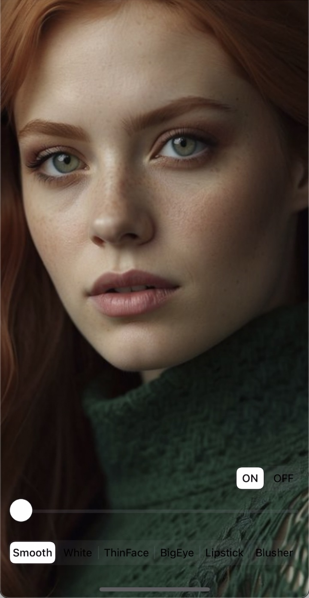
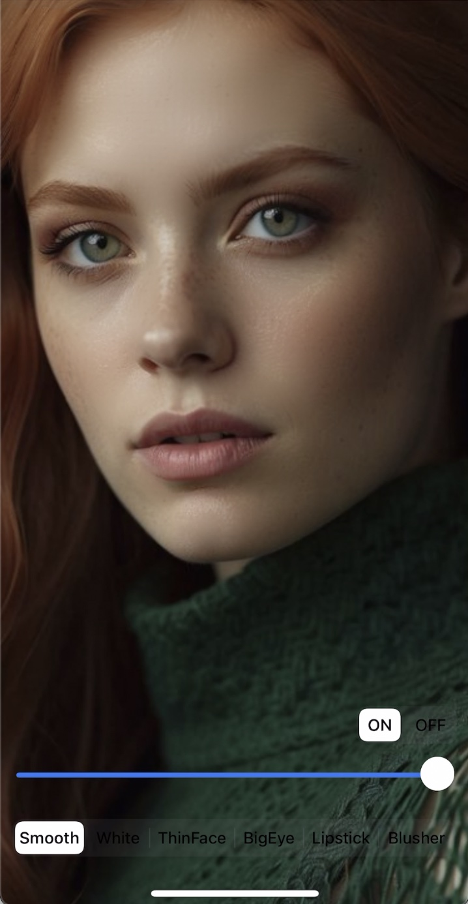
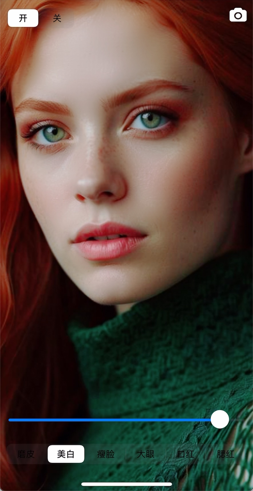
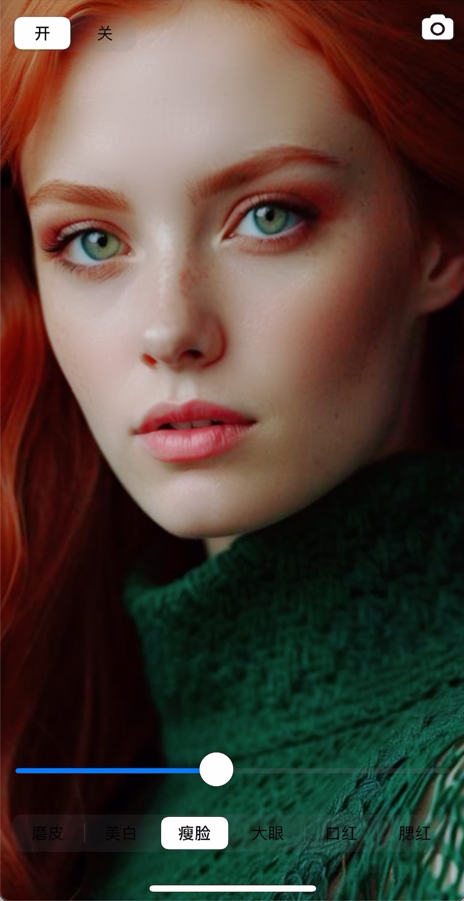
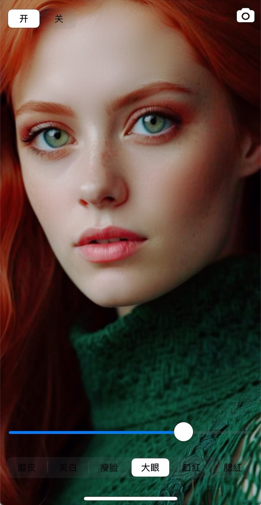
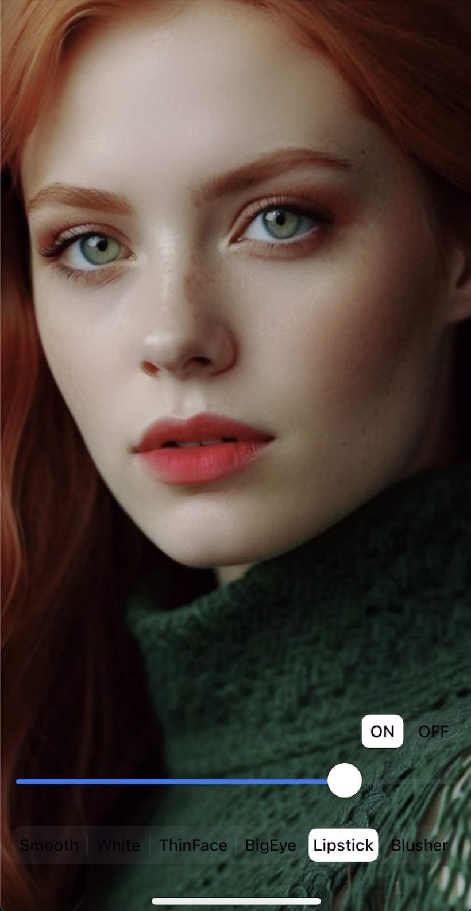
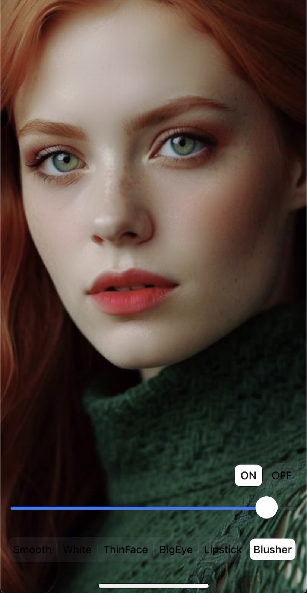
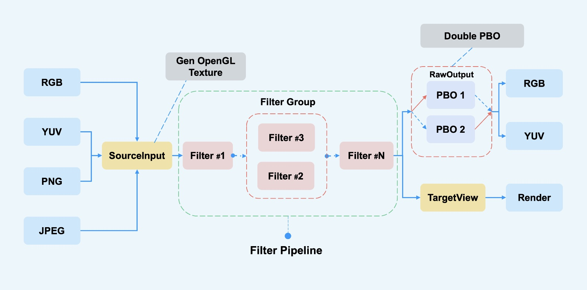

##  GPUPixel Cross-Platform Real-Time Beauty Effects Library

English | [中文](./README_cn.md) 

[GPUPixel](https://github.com/pixpark/gpupixel) @ [PixPark](https://github.com/pixpark) 

[](https://github.com/pixpark/gpupixel/stargazers)
[](https://github.com/pixpark/gpupixel/releases/latest)

[
](https://github.com/pixpark/gpupixel/blob/main/LICENSE)

## Introduction
GPUPixel is a high-performance image and video beauty effect library written in C++11. Achieving Commercial-Grade beauty effects. Extremely easy to compile and integrate, with a very small library size.

It is GPU-based and comes with built-in beauty effects filters that can achieve commercial-grade results. 

It supports platforms including iOS, Mac, Android, and it can theoretically be ported to any platform that supports OpenGL/ES.

The face key points detection currently utilizes the [Face++](https://www.faceplusplus.com.cn/) library, but it will be replaced with either **VNN** in the future.

## Effects Preview

👉👉 **Video: <a href="https://youtu.be/9BY1Qx1NEPs" target="_blank">YouTube</a> | <a href="https://www.bilibili.com/video/BV1xQ4y1L7Fh/?share_source=copy_web&vd_source=46adcb1014fa989cfcbb4cc1e866831e" target="_blank">BiliBili</a>**

|  |  |  |  |
| :--------------------------------------: | :--------------------------------------------------: | :-------------------------------------------: | :------------------------------------: |
|               **Original Image**               |                        **White**                     |                    **Smooth**                 |               **Thin face**            |
|   |  |  |  |
|                 **Big eye**              |                       **Lipstick**                       |                     **Blush**                     |                  **Original Image**                   |

## Architecture
<p align="center">
 
</p>


## Features Compared

This table compares the features supported by **GPUPixel** and **GPUImage**:

✅: Supported

❌: Not supported

✏️: Planning

|             | [GPUPixel](https://github.com/pixpark/gpupixel) | [GPUImage](https://github.com/BradLarson/GPUImage) |
| :-------------------- | :------------------------------------------------: | :---------------------------------------------: |
| **Filters:** |                         ✅                          |                        ❌                        |
| Skin Smoothing Filter |                         ✅                          |                        ❌                        |
| Skin Whitening Filter |                         ✅                          |                        ❌                        |
| Face Slimming Filter  |                         ✅                          |                        ❌                        |
| Big Eyes Filter       |                         ✅                          |                        ❌                        |
| Lipstick Filter       |                         ✅                          |                        ❌                        |
| Blush Filter          |                         ✅                          |                        ❌                        |
| More Build in Filter  |                         ✅                          |                        ✅                        |
| **Input Formats:**     |                                                    |                                                 |
| YUV420P(I420)         |                         ✅                          |                        ❌                        |
| RGBA                  |                         ✅                          |                        ✅                        |
| JPEG                  |                         ✅                          |                        ✅                        |
| PNG                   |                         ✅                          |                        ✅                        |
| NV21(for Android)     |                         ✏️                          |                        ❌                        |
| **Output Formats:**    |                                                    |                                                 |
| RGBA                  |                         ✅                          |                        ✅                        |
| YUV420P(I420)         |                         ✏️                          | ❌ |
| **Platform:**         |                                                    |                                                 |
| iOS                   |                         ✅                          |                        ✅                        |
| Mac                   |                         ✅                          | ✅ |
| Android               |                         ✅                          |                        ❌                        |
| Win                   |                         ✏️                          |                        ❌                        |
| Linux                 |                         ❌                         |                        ❌                        |


## System Requirements
|OS|iOS|OSX|Android|Windows| Linux |
|:----:|:----:|:----:|:----:|:----:|:----:|
|Min Support OS Version|10.0|10.13|5.0 (API 21)|-|-|

##  Performance
### iPhone
|-|iPhone 6P|iPhone 8|iPhone X|iPhone 11 | iPhone 14 pro |
|:----:|:----:|:----:|:----:|:----:|:----:|
|**CPU**|5%|5%|3%|3%|3%|
|**Time Taken**|10ms|4ms|3ms|3ms|3ms|
### Android
|-|Xiaomi 10| Huawei Meta30|Vivo|SAMSUNG| Google Pixel |
|:----:|:----:|:----:|:----:|:----:|:----:|
|CPU|3%|5%|-|-|-|
|Time Taken|6ms|5ms|-|-|-|


## Compilation
### iOS
Open `objc/gpupixel.xcodeproj` or `objc/demo/PixDemo.xcodeproj`  Xcode project and select the corresponding platform for compilation

### Android
Open the directory ./android in Android Studio and configure NDK r21+

## Library Size

|      | iOS(.framework) | MacOS(.framework) | Android(.aar) |
| :--: | :-------------: | :---------------: | :-----------: |
| Size |     2.4 MB      |      2.6 MB       |    2.1 MB     |


## How to Use
Refer to `./objc/demo` or `./android` demo

**`.h` file**

```c++
// video data input
std::shared_ptr<SourceRawDataInput> source_raw_input_;
// beauty filter
std::shared_ptr<FaceBeautyFilter> face_beauty_filter_;
// video data output 
std::shared_ptr<TargetRawDataOutput> target_raw_output_;
```
**Create Filter, `.c++` file**

```c++
 GPUPixel::GPUPixelContext::getInstance()->runSync([&] {
    // Create filter
    source_raw_input_ = SourceRawDataInput::create();
    target_raw_output_ = TargetRawDataOutput::create();
    // Face Beauty Filter
    face_beauty_filter_ = FaceBeautyFilter::create();
    
    // Add filter
    source_raw_input_->addTarget(face_beauty_filter_)->addTarget(target_raw_output_);
 }
```

**Input Image Data I420 or RGBA**

```c++
// ...
// YUVI420
 source_raw_input_->uploadBytes(width,
                                height, 
                                bufferY,
                                strideY, 
                                bufferU, 
                                strideU,
                                bufferV, 
                                strideV);
// ...
// bytes: RGBA data
 source_raw_input_->uploadBytes(bytes,
                                width, 
                                height, 
                                stride);
```

**Output Data Callback**


```c++
// I420 callback
target_raw_output_->setI420Callbck([=](const uint8_t *data, 
                                        int width, 
                                        int height, 
                                        int64_t ts) {
    size_t y_size = width * height;
    const uint8_t *uData = data + y_size;
    const uint8_t *vData = data + y_size + y_size / 4;
    // Do something you want
});

// RGBA callback->
target_raw_output_->setPixelsCallbck([=](const uint8_t *data, 
                                        int width, 
                                        int height, 
                                        int64_t ts) {
    size_t rgba_size = width * height*4;
    // Do something you want
});

// Output data callbck
```


## Star History

[](https://star-history.com/#pixpark/gpupixel&Date)

## Acknowledgement
### Reference Project
1. [GPUImage](https://github.com/BradLarson/GPUImage) 
2. [CainCamera](https://github.com/CainKernel/CainCamera)
3. [AwemeLike](https://github.com/ZZZZou/AwemeLike)
4. [VNN](https://github.com/joyycom/VNN)
