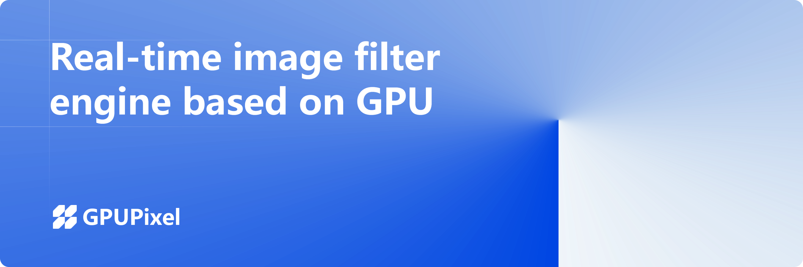

<h1 align="center">
  
</h1>

  <a href="./README.md">English</a> |
  <a href="./README_CN.md">简体中文</a>

  <a href="https://gpupixel.pixpark.net/" target="_blank">Doc</a>
   · 
  <a href="https://gpupixel.pixpark.net/zh" target="_blank">文档</a>

   
    
    
     
    

---

> 🌟 Join us in making GPUPixel better through [discussions](https://github.com/pixpark/gpupixel/discussions), [issues](https://github.com/pixpark/gpupixel/issues/new/choose), and [PRs](https://github.com/pixpark/gpupixel/pulls).

> 📢 Note: VNN face detection library has been replaced with Mars-Face from v1.3.0-beta

## Introduction

🚀 GPUPixel is a real-time, high-performance image and video filter library that's extremely easy to compile and integrate with a small footprint.

💻 GPUPixel is written in C++11 and built on OpenGL/ES, featuring built-in beauty face filters that deliver commercial-grade results.

🌐 GPUPixel supports multiple platforms including `iOS`, `Android`, `Mac`, `Win` and `Linux`, and can be ported to virtually any platform that supports OpenGL/ES.

## Effects Preview

 **Video: <a href="https://youtu.be/9BY1Qx1NEPs" target="_blank">YouTube</a>**

|                   **Origin**                    |                    **Smooth**                     |                    **White**                     |                   **ThinFace**                    |
| :---------------------------------------------: | :-----------------------------------------------: | :----------------------------------------------: | :-----------------------------------------------: |
|  |    |    |  |
|                   **BigEye**                    |                   **Lipstick**                    |                   **Blusher**                    |                    **ON-OFF**                     |
|  |  |  |    |

## Architecture

## Features

✨ This table compares the features supported by **GPUPixel**, **GPUImage**, and **Android-GPUImage**:

✅: Supported | ❌: Not supported | ✏️: Planning

|                       | [GPUPixel](https://github.com/pixpark/gpupixel) | [GPUImage](https://github.com/BradLarson/GPUImage) | [Android-GPUImage](https://github.com/cats-oss/android-gpuimage) |
| :-------------------- | :---------------------------------------------: | :------------------------------------------------: | :----------------------------------------------------------: |
| **Filters:**          |                        ✅                        |                         ❌                          |                              ❌                               |
| Skin Smoothing Filter |                        ✅                        |                         ❌                          |                              ❌                               |
| Skin Whitening Filter |                        ✅                        |                         ❌                          |                              ❌                               |
| Face Slimming Filter  |                        ✅                        |                         ❌                          |                              ❌                               |
| Big Eyes Filter       |                        ✅                        |                         ❌                          |                              ❌                               |
| Lipstick Filter       |                        ✅                        |                         ❌                          |                              ❌                               |
| Blush Filter          |                        ✅                        |                         ❌                          |                              ❌                               |
| More Build in Filter  |                        ✅                        |                         ✅                          |                              ✅                               |
| **Input Formats:**    |                                                 |                                                    |                                                              |
| YUV420P(I420)         |                        ✅                        |                         ❌                          |                              ❌                               |
| RGBA                  |                        ✅                        |                         ✅                          |                              ✅                               |
| JPEG                  |                        ✅                        |                         ✅                          |                              ✅                               |
| PNG                   |                        ✅                        |                         ✅                          |                              ✅                               |
| NV21(for Android)     |                        ✏️                        |                         ❌                          |                              ❌                               |
| **Output Formats:**   |                                                 |                                                    |                                                              |
| RGBA                  |                        ✅                        |                         ✅                          |                              ✅                               |
| YUV420P(I420)         |                        ✅                        |                         ❌                          |                              ❌                               |
| **Platform:**         |                                                 |                                                    |                                                              |
| iOS                   |                        ✅                        |                         ✅                          |                              ❌                               |
| Mac                   |                        ✅                        |                         ✅                          |                              ❌                               |
| Android               |                        ✅                        |                         ❌                          |                              ✅                               |
| Win                   |                        ✅                        |                         ❌                          |                              ❌                               |
| Linux                 |                        ✅                        |                         ❌                          |                              ❌                               |

## Before You Start
⭐ Star us on GitHub to receive instant notifications about new releases!

## Getting Started

🔍 See the docs: [Introduction](https://gpupixel.pixpark.net/guide/build) | [Build](https://gpupixel.pixpark.net/guide/build) | [Demo](https://gpupixel.pixpark.net/guide/demo) | [Integration](https://gpupixel.pixpark.net/guide/integrated)

## Contributing

🤝 Help make GPUPixel better by joining our [discussions](https://github.com/pixpark/gpupixel/discussions), opening [issues](https://github.com/pixpark/gpupixel/issues/new/choose), or submitting [PRs](https://github.com/pixpark/gpupixel/pulls). Check our [Contributing Guide](docs/docs/en/guide/contributing.md) to get started.

Please also consider supporting GPUPixel by sharing it on social media and at events and conferences.

## Contributors
 

## Sponsorship
💖 If you like this project, consider supporting us through the following methods:

| [☕ Support me on Ko-fi](docs/docs/en/sponsor.md#ko-fi) | [💝 Support on Open Collective](docs/docs/en/sponsor.md#open-collective) | [💰 WeChat Sponsor](docs/docs/en/sponsor.md#wechat) |
|:---:|:---:|:---:|

## Sponsors

🙏 Thank you to the following contributors for their generous support of the project:

<a href="https://github.com/leavenotrace">
  <picture>
    
  </picture>
</a>
<a href="https://github.com/weiyu666">
  <picture>
    
  </picture>
</a>

## Contact & Support
- 📚 [Docs](https://gpupixel.pixpark.net/) : Online documentation
- 🐛 [Issues](https://github.com/pixpark/gpupixel/issues/new/choose) : Report bugs or request features
- 📧 [Email](mailto:jaaronkot@gmail.com?subject=[GitHub]Questions%20About%20GPUPixel) : Send us a message
- 📞 [Contact](docs/docs/en/about/contact.md) : Get in touch with us

## Acknowledgements
### 🔗 Reference Projects
1. [GPUImage](https://github.com/BradLarson/GPUImage) 
2. [CainCamera](https://github.com/CainKernel/CainCamera)
3. [AwemeLike](https://github.com/ZZZZou/AwemeLike)
4. [VNN](https://github.com/joyycom/VNN)

## License
📄 This repository is available under the [MIT License](https://github.com/pixpark/gpupixel?tab=MIT-1-ov-file#readme).

