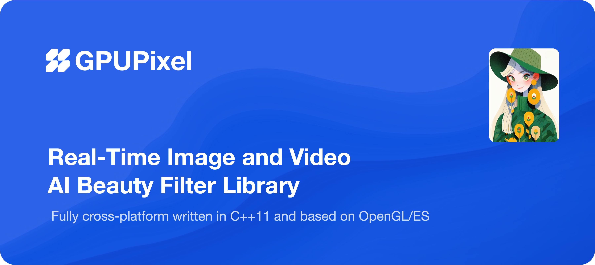
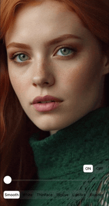
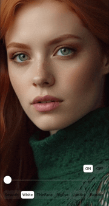
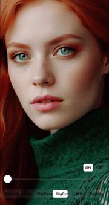
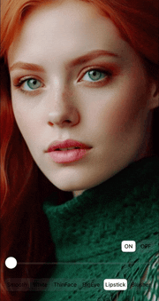
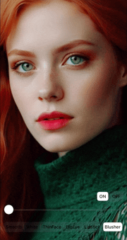
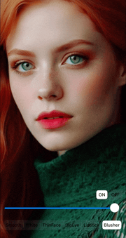
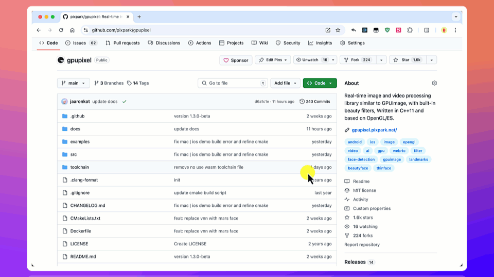

<h1 align="center">
  
</h1>

  <a href="./README.md">English</a> |
  <a href="./README_CN.md">简体中文</a>

  <a href="https://gpupixel.pixpark.net/guide/intro" target="_blank">Build</a>
   · 
  <a href="https://reactnative.dev/docs/tutorial" target="_blank">Examples</a>
   · 
  <a href="https://reactnative.dev/showcase" target="_blank">Integration</a>

   
    
    
     
    

---

> Welcome to join us to make GPUPixel better by participating [discussions](https://github.com/pixpark/gpupixel/discussions), opening [issues](https://github.com/pixpark/gpupixel/issues/new/choose), submitting [PRs](https://github.com/pixpark/gpupixel/pulls) 👏.

> Replace the VNN face detection library with Mars-Face from v1.3.0-beta

## Introduction

🍔  GPUPixel is a real-time, high-performance image and video filter library, extremely easy to compile and integrate with  small library size.

🍤 GPUPixel  is written in C++11 and is based on OpenGL/ES, incorporating a built-in beauty face filter that achieves commercial-grade beauty effects.

🍖 GPUPixel supports platforms including `iOS`, `Android`, `Mac`, `Win` and `Linux`. It can theoretically be ported to any platform that supports OpenGL/ES.

## Effects Preview

👉 **Video: <a href="https://youtu.be/9BY1Qx1NEPs" target="_blank">YouTube</a>**

|                   **Origin**                    |                    **Smooth**                     |                    **White**                     |                   **ThinFace**                    |
| :---------------------------------------------: | :-----------------------------------------------: | :----------------------------------------------: | :-----------------------------------------------: |
|  |    |    |  |
|                   **BigEye**                    |                   **Lipstick**                    |                   **Blusher**                    |                    **ON-OFF**                     |
|  |  |  |    |

## Architecture

## Features

This table compares the features supported by **GPUPixel** and **GPUImage** and **Android-GPUImage**:

✅: Supported | ❌: Not supported | ✏️: Planning

|                       | [GPUPixel](https://github.com/pixpark/gpupixel) | [GPUImage](https://github.com/BradLarson/GPUImage) | [Android-GPUImage](https://github.com/cats-oss/android-gpuimage) |
| :-------------------- | :---------------------------------------------: | :------------------------------------------------: | :----------------------------------------------------------: |
| 📷 **Filters:**        |                        ✅                        |                         ❌                          |                              ❌                               |
| Skin Smoothing Filter |                        ✅                        |                         ❌                          |                              ❌                               |
| Skin Whitening Filter |                        ✅                        |                         ❌                          |                              ❌                               |
| Face Slimming Filter  |                        ✅                        |                         ❌                          |                              ❌                               |
| Big Eyes Filter       |                        ✅                        |                         ❌                          |                              ❌                               |
| Lipstick Filter       |                        ✅                        |                         ❌                          |                              ❌                               |
| Blush Filter          |                        ✅                        |                         ❌                          |                              ❌                               |
| More Build in Filter  |                        ✅                        |                         ✅                          |                              ✅                               |
| 🎬 **Input Formats:**  |                                                 |                                                    |                                                              |
| YUV420P(I420)         |                        ✅                        |                         ❌                          |                              ❌                               |
| RGBA                  |                        ✅                        |                         ✅                          |                              ✅                               |
| JPEG                  |                        ✅                        |                         ✅                          |                              ✅                               |
| PNG                   |                        ✅                        |                         ✅                          |                              ✅                               |
| NV21(for Android)     |                        ✏️                        |                         ❌                          |                              ❌                               |
| 🎥 **Output Formats:** |                                                 |                                                    |                                                              |
| RGBA                  |                        ✅                        |                         ✅                          |                              ✅                               |
| YUV420P(I420)         |                        ✏️                        |                         ❌                          |                              ❌                               |
| 💻 **Platform:**       |                                                 |                                                    |                                                              |
| iOS                   |                        ✅                        |                         ✅                          |                              ❌                               |
| Mac                   |                        ✅                        |                         ✅                          |                              ❌                               |
| Android               |                        ✅                        |                         ❌                          |                              ✅                               |
| Win                   |                        ✅                        |                         ❌                          |                              ❌                               |
| Linux                 |                        ✅                        |                         ❌                          |                              ❌                               |

##  Performance
### iPhone
|       -        | iPhone 6P | iPhone 8 | iPhone X | iPhone 11 | iPhone 14 pro |
| :------------: | :-------: | :------: | :------: | :-------: | :-----------: |
|    **CPU**     |    5%     |    5%    |    3%    |    3%     |      3%       |
| **Time Taken** |   10ms    |   4ms    |   3ms    |    3ms    |      3ms      |
### Android
|     -      | Xiaomi 10 | Huawei Mate30 | Vivo  | SAMSUNG | Google Pixel |
| :--------: | :-------: | :-----------: | :---: | :-----: | :----------: |
|    CPU     |    3%     |      5%       |   -   |    -    |      -       |
| Time Taken |    6ms    |      5ms      |   -   |    -    |      -       |

## Lib Size

|       | iOS(.framework) | MacOS(.framework) | Android(.aar) |
| :---: | :-------------: | :---------------: | :-----------: |
| Size  |     2.4 MB      |      2.6 MB       |    2.1 MB     |

## Before You Start
⭐️ Star us on GitHub, and be instantly notified for new releases!

## Getting Started

See the doc: [Introduction](https://gpupixel.pixpark.net/guide/build) | [Build](https://gpupixel.pixpark.net/guide/build) | [Examples](https://gpupixel.pixpark.net/guide/demo) | [Integrated](https://gpupixel.pixpark.net/guide/integrated)

## Contributing

Welcome to join us to make GPUPixel better by participating [discussions](https://github.com/pixpark/gpupixel/discussions), opening [issues](https://github.com/pixpark/gpupixel/issues/new/choose), submitting [PRs](https://github.com/pixpark/gpupixel/pulls).

At the same time, please consider supporting GPUPixel by sharing it on social media and at events and conferences.

## Contributors

## Sponsorship
If you like this project, you can consider supporting me through the following methods:

|  |  |  |
|:---:|:---:|:---:|

## Donors

Thank you to the following friends for their contributions and support to the project.

## Contact & Support
- [Doc](https://gpupixel.pixpark.net/) : Online documentation.
- [Issues](https://github.com/pixpark/gpupixel/issues/new/choose) : 👉 Github Issues.
- [Mail](mailto:jaaronkot@gmail.com?subject=[GitHub]Questions%20About%20GPUPixel) : 👉 Send email to us.
- [Contact](https://gpupixel.pixpark.net/zh/about/contact) : 👉 Contact us.

## Acknowledgement
### Reference Project
1. [GPUImage](https://github.com/BradLarson/GPUImage) 
2. [CainCamera](https://github.com/CainKernel/CainCamera)
3. [AwemeLike](https://github.com/ZZZZou/AwemeLike)
4. [VNN](https://github.com/joyycom/VNN)

## License
This repository is available under the [MIT License](https://github.com/pixpark/gpupixel?tab=MIT-1-ov-file#readme).

