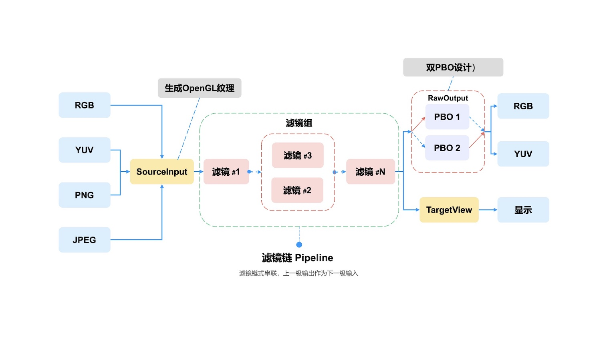

<h1 align="center">
  
</h1>

  <a href="./README.md">English</a> |
  <a href="./README_CN.md">简体中文</a>

  <a href="https://gpupixel.pixpark.net/guide/intro">编译</a>
   · 
  <a href="https://reactnative.dev/docs/tutorial">Demo</a>
   · 
  <a href="https://reactnative.dev/showcase">集成</a>

   
    
    
    

---

> Welcome to join us to make GPUPixel better by participating [discussions](https://github.com/pixpark/gpupixel/discussions), opening [issues](https://github.com/pixpark/gpupixel/issues/new/choose), submitting [PRs](https://github.com/pixpark/gpupixel/pulls). 👏

## 简介 ##

⛰️ GPUPixel是一个使用C++11编写的高性能图像和视频AI美颜效果库，非常容易编译和集成，并且库文件非常小。

🔑 它是基于GPU的，并且带有内置的美颜效果滤镜，可以实现商业级别的效果。

🔌 它支持的平台包括iOS、Mac和Android，理论上可以移植到任何支持OpenGL/ES的平台。

## 效果
👉 **视频: <a href="https://youtu.be/9BY1Qx1NEPs" target="_blank">YouTube</a> | <a href="https://www.bilibili.com/video/BV1xQ4y1L7Fh/?share_source=copy_web&vd_source=46adcb1014fa989cfcbb4cc1e866831e" target="_blank">BiliBili</a>**

|              **原图**              |                **磨皮**                |               **美白**               |              **ThinFace**              |
| :--------------------------------: | :------------------------------------: | :----------------------------------: | :------------------------------------: |
|  |      |      |  |
|              **大眼**              |                **口红**                |               **腮红**               |                  **开                  | 关** |
|  |  |  |      |

## 架构流程

## 特性对比

✅: 支持 | ❌: 不支持 | ✏️: 计划中

|                   | [GPUPixel](https://github.com/pixpark/gpupixel) | [GPUImage](https://github.com/BradLarson/GPUImage) |
| :---------------- | :---------------------------------------------: | :------------------------------------------------: |
| 🍎**滤镜:**        |                        ✅                        |                         ❌                          |
| 磨皮              |                        ✅                        |                         ❌                          |
| 美白              |                        ✅                        |                         ❌                          |
| 瘦脸              |                        ✅                        |                         ❌                          |
| 大眼              |                        ✅                        |                         ❌                          |
| 口红              |                        ✅                        |                         ❌                          |
| 腮红              |                        ✅                        |                         ❌                          |
| 内建滤镜          |                        ✅                        |                         ✅                          |
| 🍓**输入格式：**   |                                                 |                                                    |
| YUV420P(I420)     |                        ✅                        |                         ❌                          |
| RGBA              |                        ✅                        |                         ✅                          |
| JPEG              |                        ✅                        |                         ✅                          |
| PNG               |                        ✅                        |                         ✅                          |
| NV21(for Android) |                        ✏️                        |                         ❌                          |
| 🍉**输出格式 :**   |                                                 |                                                    |
| RGBA              |                        ✅                        |                         ✅                          |
| YUV420P(I420)     |                        ✅                        |                         ❌                          |
| 🥑**平台系统:**    |                                                 |                                                    |
| iOS               |                        ✅                        |                         ✅                          |
| Mac               |                        ✅                        |                         ✅                          |
| Android           |                        ✅                        |                         ❌                          |
| Win               |                        ✅                        |                         ❌                          |
| Linux             |                        ✅                        |                         ❌                          |

## 系统最低版本
|           OS           |  iOS  |  OSX  |   Android    | Windows | Linux |
| :--------------------: | :---: | :---: | :----------: | :-----: | :---: |
| Min Support OS Version | 10.0  | 10.13 | 5.0 (API 21) |    -    |   -   |

##  性能
### iPhone
|       -        | iPhone 6P | iPhone 8 | iPhone X | iPhone 11 | iPhone 14 pro |
| :------------: | :-------: | :------: | :------: | :-------: | :-----------: |
|    **CPU**     |    5%     |    5%    |    3%    |    3%     |      3%       |
| **Time Taken** |   10ms    |   4ms    |   3ms    |    3ms    |      3ms      |
### Android
|     -      | Xiaomi 10 | Huawei Mate30 | Vivo  | SAMSUNG | Google Pixel |
| :--------: | :-------: | :-----------: | :---: | :-----: | :----------: |
|    CPU     |    3%     |      5%       |   -   |    -    |      -       |
| Time Taken |    6ms    |      5ms      |   -   |    -    |      -       |

## 库体积

|       | iOS(.framework) | MacOS(.framework) | Android(.aar) |
| :---: | :-------------: | :---------------: | :-----------: |
| Size  |     2.4 MB      |      2.6 MB       |    2.1 MB     |

## 开始之前
⭐️ 老铁给个星星，求点赞!

## 快速开始

查看文档:  [简介](https://gpupixel.pixpark.net/zh/guide/build) | [编译](https://gpupixel.pixpark.net/zh/guide/build) | [示例](https://gpupixel.pixpark.net/zh/guide/demo) | [集成](https://gpupixel.pixpark.net/zh/guide/integrated)

## 参与贡献

欢迎参与此项目，贡献代码，同时希望通过在社交媒体分享 GPUPixel 项目来支持本项目  👏🏻.

## 联系 & 支持
- [Doc](https://gpupixel.pixpark.net/): 在线文档.
- [Issues](https://github.com/pixpark/gpupixel/issues/new/choose): Github Issues
- [Mail](mailto:jaaronkot@gmail.com?subject=[GitHub]Questions%20About%20GPUPixel)  👉：向我们发送邮件
 - [添加微信]() 👉： 

## 感谢
### 参考项目
1. [GPUImage](https://github.com/BradLarson/GPUImage) 
2. [CainCamera](https://github.com/CainKernel/CainCamera)
3. [AwemeLike](https://github.com/ZZZZou/AwemeLike)
4. [VNN](https://github.com/joyycom/VNN)

## License
This repository is available under the [MIT License](https://github.com/pixpark/gpupixel?tab=MIT-1-ov-file#readme).

