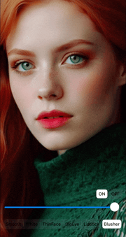

<h1 align="center">
  <a href="https://github.com/pixpark/gpupixel"></a>
</h1>

<p align="center">
  <a href="./README.md">English</a> |
  <a href="./README_CN.md">简体中文</a>
</p>

<p align="center">
   <a href="https://github.com/pixpark/gpupixel/stargazers"></a>
    <a href="https://github.com/pixpark/gpupixel/releases/latest"></a>
    <a href="#"></a>
    <a href="https://github.com/pixpark/gpupixel/blob/main/LICENSE"></a>
</p>

---
> 欢迎大家加入使得 GPUPixel 更好，通过讨论 [discussions](https://github.com/pixpark/gpupixel/discussions), 提交 [issues](https://github.com/pixpark/gpupixel/issues/new/choose), 提交 [PRs](https://github.com/pixpark/gpupixel/pulls).

> 📢 人脸关键点检测从 v1.2.0开始已经由 Face++ 替换为 VNN, 不需要联网认证（不需要交钱了），并且支持了全端，欢迎各位客观品尝食用 👏

## 简介 ##

⛰️ GPUPixel是一个使用C++11编写的高性能图像和视频AI美颜效果库，非常容易编译和集成，并且库文件非常小。

🔑 它是基于GPU的，并且带有内置的美颜效果滤镜，可以实现商业级别的效果。

🔌 它支持的平台包括iOS、Mac和Android，理论上可以移植到任何支持OpenGL/ES的平台。


## 效果
👉 **视频: <a href="https://youtu.be/9BY1Qx1NEPs" target="_blank">YouTube</a> | <a href="https://www.bilibili.com/video/BV1xQ4y1L7Fh/?share_source=copy_web&vd_source=46adcb1014fa989cfcbb4cc1e866831e" target="_blank">BiliBili</a>**


|              **原图**              |                **磨皮**                |               **美白**               |              **ThinFace**              |
| :--------------------------------: | :------------------------------------: | :----------------------------------: | :------------------------------------: |
|  |      |      |  |
|              **大眼**              |                **口红**                |               **腮红**               |                  **开                  | 关** |
|  |  |  |      |
 
## 架构流程

 
## 特性对比

✅: 支持 | ❌: 不支持 | ✏️: 计划中

|                   | [GPUPixel](https://github.com/pixpark/gpupixel) | [GPUImage](https://github.com/BradLarson/GPUImage) |
| :---------------- | :---------------------------------------------: | :------------------------------------------------: |
| 🍎**滤镜:**        |                        ✅                        |                         ❌                          |
| 磨皮              |                        ✅                        |                         ❌                          |
| 美白              |                        ✅                        |                         ❌                          |
| 瘦脸              |                        ✅                        |                         ❌                          |
| 大眼              |                        ✅                        |                         ❌                          |
| 口红              |                        ✅                        |                         ❌                          |
| 腮红              |                        ✅                        |                         ❌                          |
| 内建滤镜          |                        ✅                        |                         ✅                          |
| 🍓**输入格式：**   |                                                 |                                                    |
| YUV420P(I420)     |                        ✅                        |                         ❌                          |
| RGBA              |                        ✅                        |                         ✅                          |
| JPEG              |                        ✅                        |                         ✅                          |
| PNG               |                        ✅                        |                         ✅                          |
| NV21(for Android) |                        ✏️                        |                         ❌                          |
| 🍉**输出格式 :**   |                                                 |                                                    |
| RGBA              |                        ✅                        |                         ✅                          |
| YUV420P(I420)     |                        ✅                        |                         ❌                          |
| 🥑**平台系统:**    |                                                 |                                                    |
| iOS               |                        ✅                        |                         ✅                          |
| Mac               |                        ✅                        |                         ✅                          |
| Android           |                        ✅                        |                         ❌                          |
| Win               |                        ✅                        |                         ❌                          |
| Linux             |                        ✅                        |                         ❌                          |


## 系统最低版本
|           OS           |  iOS  |  OSX  |   Android    | Windows | Linux |
| :--------------------: | :---: | :---: | :----------: | :-----: | :---: |
| Min Support OS Version | 10.0  | 10.13 | 5.0 (API 21) |    -    |   -   |

##  性能
### iPhone
|       -        | iPhone 6P | iPhone 8 | iPhone X | iPhone 11 | iPhone 14 pro |
| :------------: | :-------: | :------: | :------: | :-------: | :-----------: |
|    **CPU**     |    5%     |    5%    |    3%    |    3%     |      3%       |
| **Time Taken** |   10ms    |   4ms    |   3ms    |    3ms    |      3ms      |
### Android
|     -      | Xiaomi 10 | Huawei Mate30 | Vivo  | SAMSUNG | Google Pixel |
| :--------: | :-------: | :-----------: | :---: | :-----: | :----------: |
|    CPU     |    3%     |      5%       |   -   |    -    |      -       |
| Time Taken |    6ms    |      5ms      |   -   |    -    |      -       |
 
## 库体积

|       | iOS(.framework) | MacOS(.framework) | Android(.aar) |
| :---: | :-------------: | :---------------: | :-----------: |
| Size  |     2.4 MB      |      2.6 MB       |    2.1 MB     |

 
## 开始之前
⭐️ 老铁给个星星，求点赞!


 
## 快速开始

### 如何编译
从 v1.1.0开始使用 cmake 编译, 请自行搜索下cmake的安装配置. 
库和生成的 demo 程序会在项目根目录的 output 目录
 
### iOS 

```shell
# Generate project
## for iOS arm64
cmake -G Xcode -B build -S src -DCMAKE_TOOLCHAIN_FILE=toolchain/ios.toolchain.cmake -DPLATFORM=OS64
 
# Build
cmake --build build --config Debug #or Release
```
### Mac

```shell
# Generate project
## for Mac Apple Silicon
cmake -G Xcode -B build -S src -DCMAKE_TOOLCHAIN_FILE=toolchain/ios.toolchain.cmake -DPLATFORM=MAC_ARM64
## for Mac Intel
cmake -G Xcode -B build -S src -DCMAKE_TOOLCHAIN_FILE=toolchain/ios.toolchain.cmake -DPLATFORM=MAC

# Build
cmake --build build --config Debug #or Release
```

### Android
Open the directory `src/android/java` in Android Studio.

### Windows
需提前安装 Cmake and MinGW64
```shell
# Generate project
cmake -G "MinGW Makefiles" -B build -S src

# Build
cmake --build build -DCMAKE_BUILD_TYPE=Debug #or Release
```
### Linux (Test on ubuntu)

```shell
# install cmake 
sudo apt-get install cmake pkg-config
# install dependent lib
sudo apt-get install mesa-utils libglu1-mesa-dev freeglut3-dev mesa-common-dev libglfw3-dev

# Generate project
cmake -B build -S src

# Build
cmake --build build -DCMAKE_BUILD_TYPE=Debug #or Release 
```

## App demo
 
### iOS and Mac
参考 `examples/ios` and `examples/mac`
### Android
参考  `src/android/java`
### Window and Linux

参考  `examples/desktop` 

```shell
# Generate project
cmake -G "MinGW Makefiles" -B examples/build -S examples

# Build
cmake --build build -DCMAKE_BUILD_TYPE=Debug #or Release 
```
#### App 使用 
<kbd>A</kbd> <kbd>S</kbd> <kbd>D</kbd> <kbd>F</kbd> <kbd>G</kbd> <kbd>H</kbd> - 增加 smooth, white, thin face, big eye, lipstick, blusher 的值.

<kbd>Z</kbd> <kbd>X</kbd> <kbd>C</kbd> <kbd>V</kbd> <kbd>B</kbd> <kbd>N</kbd> - 减小 smooth, white, thin face, big eye, lipstick, blusher 的值. 

## C++ 接口调用
**声明 filters**

```c++
// video data input
std::shared_ptr<SourceRawDataInput> source_raw_input_;
// beauty filter
std::shared_ptr<BeautyFaceFilter> beauty_face_filter_;
// video data output 
std::shared_ptr<TargetRawDataOutput> target_raw_output_;
```
**创建和串联 filters**

```c++
 gpupixel::GPUPixelContext::getInstance()->runSync([&] {
    // Create filter
    source_raw_input_ = SourceRawDataInput::create();
    target_raw_output_ = TargetRawDataOutput::create();
    // Face Beauty Filter
    beauty_face_filter_ = BeautyFaceFilter::create();
    
    // Add filter
    source_raw_input_->addTarget(beauty_face_filter_)
                     ->addTarget(target_raw_output_);
 }
```

**输入 YUV420P 或 RGBA数据**

```c++
// ...
// YUVI420
 source_raw_input_->uploadBytes(width,
                                height, 
                                bufferY,
                                strideY, 
                                bufferU, 
                                strideU,
                                bufferV, 
                                strideV);
// ...
// bytes: RGBA data
 source_raw_input_->uploadBytes(bytes,
                                width, 
                                height, 
                                stride);
```

**获取输出数据**

```c++
// I420 callback
target_raw_output_->setI420Callbck([=](const uint8_t *data, 
                                        int width, 
                                        int height, 
                                        int64_t ts) {
    size_t y_size = width * height;
    const uint8_t *uData = data + y_size;
    const uint8_t *vData = data + y_size + y_size / 4;
    // Do something you want
});

// RGBA callback->
target_raw_output_->setPixelsCallbck([=](const uint8_t *data, 
                                        int width, 
                                        int height, 
                                        int64_t ts) {
    size_t rgba_size = width * height*4;
    // Do something you want
});

// Output data callbck
```
 

## Star History

[](https://star-history.com/#pixpark/gpupixel&Date)

## 参与贡献
欢迎参与此项目，贡献代码，同时希望通过在社交媒体分享 GPUPixel 项目来支持本项目  👏🏻.


## 感谢
### 参考项目
1. [GPUImage](https://github.com/BradLarson/GPUImage) 
2. [CainCamera](https://github.com/CainKernel/CainCamera)
3. [AwemeLike](https://github.com/ZZZZou/AwemeLike)
4. [VNN](https://github.com/joyycom/VNN)

## License
This repository is available under the [MIT License](https://github.com/pixpark/gpupixel?tab=MIT-1-ov-file#readme).

