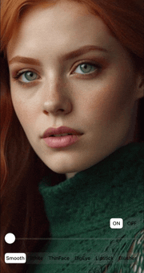

<h1 align="center">
  <a href="https://github.com/pixpark/gpupixel"></a>
</h1>

<p align="center">
  <a href="./README.md">English</a> |
  <a href="./README_CN.md">简体中文</a>
</p>

<p align="center">
   <a href="https://github.com/pixpark/gpupixel/stargazers"></a>
    <a href="https://github.com/pixpark/gpupixel/releases/latest"></a>
    <a href="#"></a>
    <a href="https://github.com/pixpark/gpupixel/blob/main/LICENSE"></a>
</p>

---

> 📢 人脸关键点检测已经从 Face++ 替换为 VNN, 不需要联网认证（不需要交钱了），并且支持了全端，欢迎各位客观品尝食用 👏

## 简介 ##

⛰️ GPUPixel是一个使用C++11编写的高性能图像和视频AI美颜效果库，非常容易编译和集成，并且库文件非常小。

🔑 它是基于GPU的，并且带有内置的美颜效果滤镜，可以实现商业级别的效果。

🔌 它支持的平台包括iOS、Mac和Android，理论上可以移植到任何支持OpenGL/ES的平台。


## 效果
👉 **视频: <a href="https://youtu.be/9BY1Qx1NEPs" target="_blank">YouTube</a> | <a href="https://www.bilibili.com/video/BV1xQ4y1L7Fh/?share_source=copy_web&vd_source=46adcb1014fa989cfcbb4cc1e866831e" target="_blank">BiliBili</a>**


|              **原图**              |                **磨皮**                |               **美白**               |              **ThinFace**              |
| :--------------------------------: | :------------------------------------: | :----------------------------------: | :------------------------------------: |
|  |      |      |  |
|              **大眼**              |                **口红**                |               **腮红**               |                  **开                  | 关** |
|  |  |  |      |
 
## 架构流程

 
## 特性对比

✅: 支持 | ❌: 不支持 | ✏️: 计划中

|                   | [GPUPixel](https://github.com/pixpark/gpupixel) | [GPUImage](https://github.com/BradLarson/GPUImage) |
| :---------------- | :---------------------------------------------: | :------------------------------------------------: |
| 🍎**滤镜:**        |                        ✅                        |                         ❌                          |
| 磨皮              |                        ✅                        |                         ❌                          |
| 美白              |                        ✅                        |                         ❌                          |
| 瘦脸              |                        ✅                        |                         ❌                          |
| 大眼              |                        ✅                        |                         ❌                          |
| 口红              |                        ✅                        |                         ❌                          |
| 腮红              |                        ✅                        |                         ❌                          |
| 内建滤镜          |                        ✅                        |                         ✅                          |
| 🍓**输入格式：**   |                                                 |                                                    |
| YUV420P(I420)     |                        ✅                        |                         ❌                          |
| RGBA              |                        ✅                        |                         ✅                          |
| JPEG              |                        ✅                        |                         ✅                          |
| PNG               |                        ✅                        |                         ✅                          |
| NV21(for Android) |                        ✏️                        |                         ❌                          |
| 🍉**输出格式 :**   |                                                 |                                                    |
| RGBA              |                        ✅                        |                         ✅                          |
| YUV420P(I420)     |                        ✏️                        |                         ❌                          |
| 🥑**平台系统:**    |                                                 |                                                    |
| iOS               |                        ✅                        |                         ✅                          |
| Mac               |                        ✅                        |                         ✅                          |
| Android           |                        ✅                        |                         ❌                          |
| Win               |                        ✏️                        |                         ❌                          |
| Linux             |                        ✏️                        |                         ❌                          |


## 系统最低版本
|           OS           |  iOS  |  OSX  |   Android    | Windows | Linux |
| :--------------------: | :---: | :---: | :----------: | :-----: | :---: |
| Min Support OS Version | 10.0  | 10.13 | 5.0 (API 21) |    -    |   -   |

##  性能
### iPhone
|       -        | iPhone 6P | iPhone 8 | iPhone X | iPhone 11 | iPhone 14 pro |
| :------------: | :-------: | :------: | :------: | :-------: | :-----------: |
|    **CPU**     |    5%     |    5%    |    3%    |    3%     |      3%       |
| **Time Taken** |   10ms    |   4ms    |   3ms    |    3ms    |      3ms      |
### Android
|     -      | Xiaomi 10 | Huawei Mate30 | Vivo  | SAMSUNG | Google Pixel |
| :--------: | :-------: | :-----------: | :---: | :-----: | :----------: |
|    CPU     |    3%     |      5%       |   -   |    -    |      -       |
| Time Taken |    6ms    |      5ms      |   -   |    -    |      -       |
 
## 库体积

|       | iOS(.framework) | MacOS(.framework) | Android(.aar) |
| :---: | :-------------: | :---------------: | :-----------: |
| Size  |     2.4 MB      |      2.6 MB       |    2.1 MB     |

 
## 编译
### iOS
打开 `objc/gpupixel.xcodeproj` 或 `objc/demo/PixDemo.xcodeproj`  Xcode工程

### Android
Android Studio 打开目录 `./android`, 配置 `NDK r21+`

## 接口调用
参考`./objc/demo` 或 `./android` demo
**`.h` file**

```c++
// video data input
std::shared_ptr<SourceRawDataInput> source_raw_input_;
// beauty filter
std::shared_ptr<FaceBeautyFilter> face_beauty_filter_;
// video data output 
std::shared_ptr<TargetRawDataOutput> target_raw_output_;
```
**Create Filter, `.c++` file**

```c++
 gpupixel::GPUPixelContext::getInstance()->runSync([&] {
    // Create filter
    source_raw_input_ = SourceRawDataInput::create();
    target_raw_output_ = TargetRawDataOutput::create();
    // Face Beauty Filter
    face_beauty_filter_ = FaceBeautyFilter::create();
    
    // Add filter
    source_raw_input_->addTarget(face_beauty_filter_)->addTarget(target_raw_output_);
 }
```

**输入图像数据 I420 or RGBA**

```c++
// ...
// YUVI420
 source_raw_input_->uploadBytes(width,
                                height, 
                                bufferY,
                                strideY, 
                                bufferU, 
                                strideU,
                                bufferV, 
                                strideV);
// ...
// bytes: RGBA data
 source_raw_input_->uploadBytes(bytes,
                                width, 
                                height, 
                                stride);
```

**输出数据回调**

```c++
// I420 callback
target_raw_output_->setI420Callbck([=](const uint8_t *data, 
                                        int width, 
                                        int height, 
                                        int64_t ts) {
    size_t y_size = width * height;
    const uint8_t *uData = data + y_size;
    const uint8_t *vData = data + y_size + y_size / 4;
    // Do something you want
});

// RGBA callback->
target_raw_output_->setPixelsCallbck([=](const uint8_t *data, 
                                        int width, 
                                        int height, 
                                        int64_t ts) {
    size_t rgba_size = width * height*4;
    // Do something you want
});

// Output data callbck
```
