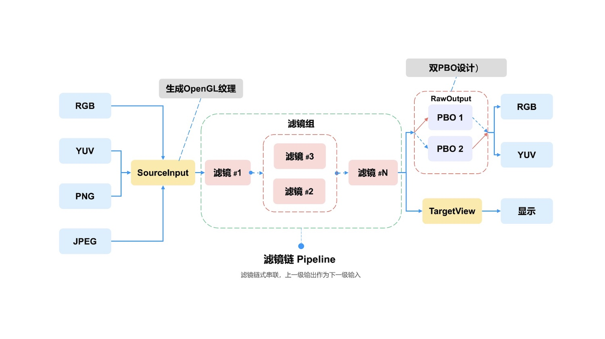

# GPUPixel - Realtime video and image processing library
<p align="left">
<a href="./doc/README_en.md"> English &nbsp;|&nbsp; </a>  
<a href="./README.md"> 简体中文 &nbsp; </a>
</p>
<p align="left">
<a href="https://github.com/pixpark/gpupixel">gpupixel</a>
@
<a href="https://github.com/pixpark">PixPark</a> 
</p>

<p align="left">

[](https://github.com/pixpark/gpupixel/stargazers)
[](https://github.com/pixpark/gpupixel/releases/latest)

[
](https://github.com/pixpark/gpupixel/blob/main/LICENSE)

</p> 

## 简介 ##

GPUPixel是一个由C++11编写的高性能图像和视频处理库, 基于GPU, 内置美颜特效滤镜, 效果可以达到商用级别.
支持的平台包括iOS, Mac, Android, 理论上可以移植到所有支持OpenGL/ES的平台.

## 效果

**美白&磨皮**

 


## 架构
  

## 功能 ##

### 美颜滤镜
- [x] 磨皮滤镜 
- [x] 美白滤镜
- [x] 红润滤镜
- [x] 瘦脸滤镜
- [x] 大眼滤镜
- [x] 口红滤镜
- [x] 腮红滤镜

### 输入格式
- [x] YUV420P(I420)
- [x] RGBA
- [x] JPEG
- [x] PNG
- [ ] NV12

### 输出格式
- [x] RGBA
- [ ] YUV420P
- [ ] NV12

### 基础滤镜
[基础滤镜列表]()

### 其他滤镜
- [x] 图片水印
- [ ] 贴纸特效
- [ ] 文字水印
- [ ] 风格滤镜

## 效果预览


## 系统要求
|系统|iOS|OSX|Android|Windows| Linux |
|:----:|:----:|:----:|:----:|:----:|:----:|
|最低版本|10.0+|10.13+|5.0+|-|-|

## 性能 ##
### iPhone
|-|iPhone 6P|iPhone 8|iPhone X|iPhone 11 | iPhone 14 pro |
|:----:|:----:|:----:|:----:|:----:|:----:|
|CPU|-|-|-|-|-|
|耗时|-ms|-ms|-ms|-|-|
### Android
|-|Xiaomi 10| Huawei Meta30|Vivo|SAMSUNG| Google Pixel |
|:----:|:----:|:----:|:----:|:----:|:----:|
|CPU|-|-|-|-|-|
|耗时|-ms|-ms|-ms|-|-|


## 编译 ##
### iOS
打开 `objc/gpupixel.xcodeproj` 或 `objc/demo/PixDemo.xcodeproj`  Xcode工程, 选择对应平台编译.

### Android
Android Studio 打开目录 `./android`, 配置 `NDK r21+`
## 接口调用 ##
参考`./objc/demo` 或 `./android` demo
**`.h` file**

```c++
// video data input
std::shared_ptr<SourceRawDataInput> source_raw_input_;
// beauty filter
std::shared_ptr<FaceBeautyFilter> face_beauty_filter_;
// video data output 
std::shared_ptr<TargetRawDataOutput> target_raw_output_;
```
**Create Filter, `.c++` file**

```c++
 GPUPixel::GPUPixelContext::getInstance()->runSync([&] {
    // Create filter
    source_raw_input_ = SourceRawDataInput::create();
    target_raw_output_ = TargetRawDataOutput::create();
    // Face Beauty Filter
    face_beauty_filter_ = FaceBeautyFilter::create();
    
    // Add filter
    source_raw_input_->addTarget(face_beauty_filter_)->addTarget(target_raw_output_);
 }
```

**输入图像数据 I420 or RGBA**

```c++
// ...
// YUVI420
 source_raw_input_->uploadBytes(width,
                                height, 
                                bufferY,
                                strideY, 
                                bufferU, 
                                strideU,
                                bufferV, 
                                strideV);
// ...
// bytes: RGBA data
 source_raw_input_->uploadBytes(bytes,
                                width, 
                                height, 
                                stride);
```

**输出数据回调**


```c++
// I420 callback
target_raw_output_->setI420Callbck([=](const uint8_t *data, 
                                        int width, 
                                        int height, 
                                        int64_t ts) {
    size_t y_size = width * height;
    const uint8_t *uData = data + y_size;
    const uint8_t *vData = data + y_size + y_size / 4;
    // Do something you want
});

// RGBA callback->
target_raw_output_->setPixelsCallbck([=](const uint8_t *data, 
                                        int width, 
                                        int height, 
                                        int64_t ts) {
    size_t rgba_size = width * height*4;
    // Do something you want
});

// Output data callbck
```
