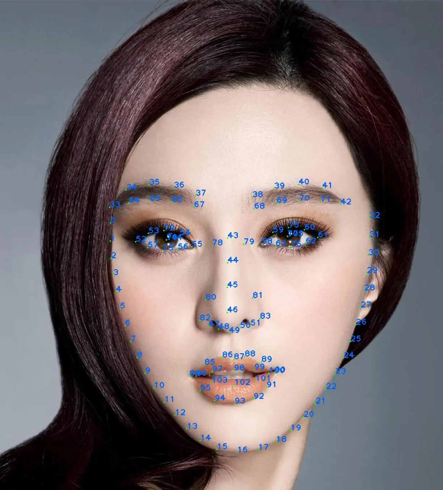

# Face Landmarks

## Overview
GPUPixel use Mars Face detect face landmarks, Mars Face SDK  a high-performance face detection and facial landmark detection solution based on MNN (Mobile Neural Network) framework. It provides accurate face detection and returns 106 basic facial landmarks, with an extension to 111 landmarks for more detailed facial feature analysis.

## Features
- High-performance face detection based on MNN framework
- 106 basic facial landmarks detection
- Extended 111 facial landmarks
- Cross-platform support
- Easy-to-use API interface

## Basic Facial Landmarks
The SDK detects 106 basic facial landmarks that cover key facial features including:
- Eyes contours
- Eyebrows
- Nose
- Mouth outline
- Face contour

## Extended Landmarks
Based on the 106 basic landmarks, the SDK calculates 5 additional landmarks (107-111) using specific facial feature points:

- Point 106: Midpoint between landmarks 102 and 98
- Point 107: Midpoint between landmarks 35 and 65
- Point 108: Midpoint between landmarks 70 and 40
- Point 109: Midpoint between landmarks 5 and 80
- Point 110: Midpoint between landmarks 81 and 27

These additional points provide more detailed facial feature information for advanced applications.

## Face Landmark Dot



## Integration Guide

### Initialization
```cpp
#include "face_detector.h"

// Create face detector instance
FaceDetector detector;

// The detector will be automatically initialized with the resource path
```

### Face Detection and Landmark Extraction
```cpp
// Register callback to receive detection results
detector.RegCallback([](std::vector<float> landmarks) {
    // Process landmarks
    // landmarks contains normalized coordinates (x,y) for all 111 points
});

// Perform detection on image data
detector.Detect(
    imageData,      // image data pointer
    width,          // image width
    height,         // image height
    format,         // image format
    frameType       // frame type
);
```

### Image Format Support
The SDK supports various input formats including:
- RGBA8888
- YUVI420

## Performance Considerations
- The SDK is optimized for mobile and embedded devices using MNN framework
- Landmark coordinates are normalized to [0,1] range
- Detection results are provided through callback mechanism for efficient integration

## API Reference

### FaceDetector Class
```cpp
class FaceDetector {
    public:
        FaceDetector();
        ~FaceDetector();
        
        // Perform face detection on image data
        int Detect(const uint8_t* data,
                   int width,
                   int height,
                   GPUPIXEL_MODE_FMT fmt,
                   GPUPIXEL_FRAME_TYPE type);
        
        // Register callback for detection results
        int RegCallback(FaceDetectorCallback callback);
};
```

### Callback Function
```cpp
typedef std::function<void(std::vector<float> landmarks)> FaceDetectorCallback;
```

### Detection Result
The landmarks vector in the callback contains normalized (x,y) coordinates for all 111 points, arranged sequentially:
- Index 0-211: Basic 106 landmarks (x,y pairs)
- Index 212-221: Extended 5 landmarks (x,y pairs)