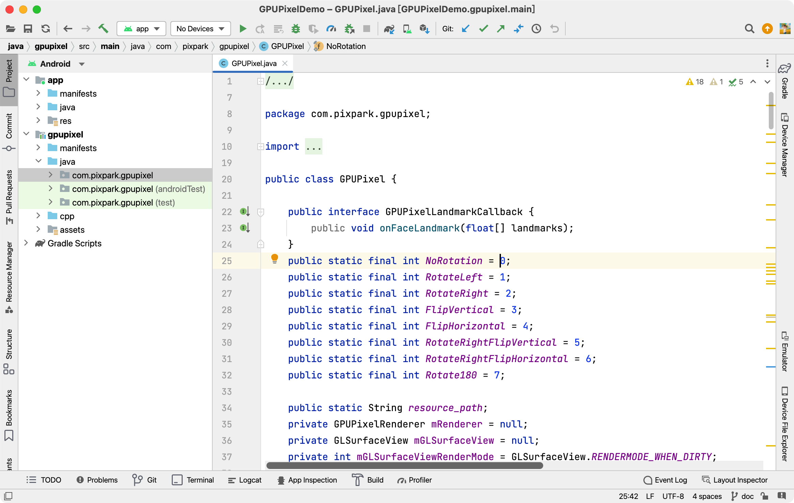
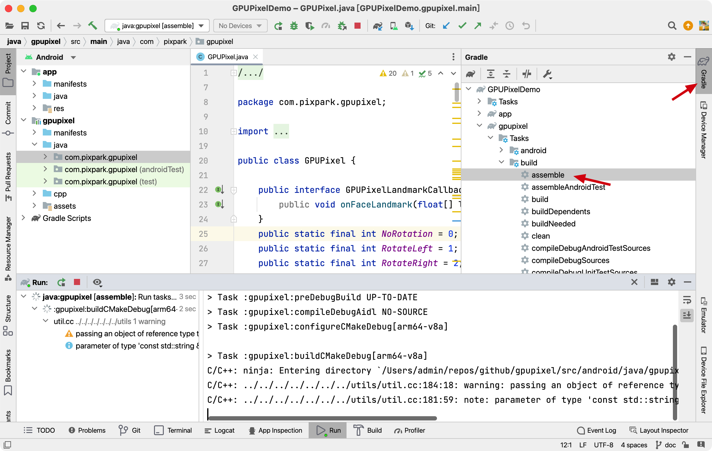
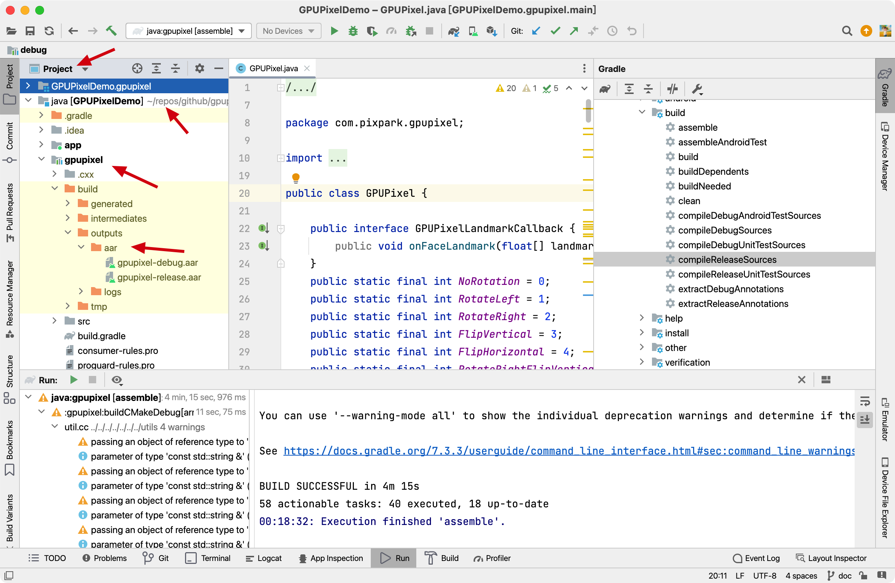

---

title: Build
editLink: true
description: This article will introduce the compilation methods for the GPUPixel library on various system platforms.
---

# Build

This chapter will introduce the compilation methods for the GPUPixel library on various system platforms.

::: tip
Starting from version [v1.1.0](https://github.com/pixpark/gpupixel/releases/tag/v1.1.1), the source code is compiled using CMake. The latest precompiled libraries for various platforms can be found [here](https://github.com/pixpark/gpupixel/releases/latest).
:::

## iOS
Execute the following commands at the root directory of the project.

**Generate Project**
::: code-group
```bash [Arm64]
cmake -G Xcode -B build -S src -DCMAKE_TOOLCHAIN_FILE=../toolchain/ios.toolchain.cmake -DPLATFORM=OS64
```
:::

**Compile**
::: code-group

```bash [Release]
cmake --build build --config Release
```

```bash [Debug]
cmake --build build --config Debug
```
:::

**Output**

The compilation output is located in the `output` path under the root directory of the project, containing the following:
```bash
output
├── include   # Header files
├── library   # Library files
└── resources # Resource files
```
For iOS, you only need to use the `.framework` library under `library`, which already contains header files and resource files.

## MacOS
Execute the following commands at the root directory of the project.

**Generate Project**
::: code-group
```bash [Apple Silicon]
cmake -G Xcode -B build -S src -DCMAKE_TOOLCHAIN_FILE=../toolchain/ios.toolchain.cmake -DPLATFORM=MAC_ARM64
```
```bash [Intel]
cmake -G Xcode -B build -S src -DCMAKE_TOOLCHAIN_FILE=../toolchain/ios.toolchain.cmake -DPLATFORM=MAC
```
:::

**Compile**
::: code-group

```bash [Release]
cmake --build build --config Release
```

```bash [Debug]
cmake --build build --config Debug
```
:::

**Output**

The compilation output is located in the `output` path under the root directory of the project, containing the following:
```bash
output
├── include   # Header files
├── library   # Library files
└── resources # Resource files
```
For macOS, you only need to use the `.framework` library under `library`, which already contains header files and resource files.

## Android

Open the directory `src/android/java` with Android Studio, which will automatically start downloading dependencies such as Gradle.

**Project Structure**

Includes demo and gpupixel module, as follows:



**Compile**

Double-click `gradle -> gpupixel -> build -> assemble` to start compiling.



**Output**

Switch to the project view, the output is located at: `src/android/java/gpupixel/build/outputs/aar`



**Gradle Command Compile**

If the Gradle command environment has been configured, you can also use `gradlew` to compile.

```bash
./gradlew :gpupixel:assembleRelease
```

The output is located at: `src/android/java/gpupixel/build/outputs/aar`

## Windows

Compiling on Windows requires the installation of CMake and MinGW64.

**Generate Project**

```bash
# Generate project
cmake -G "MinGW Makefiles" -B build -S src
```
::: code-group

```bash [Release]
cmake --build build -DCMAKE_BUILD_TYPE=Release
```

```bash [Debug]
cmake --build build -DCMAKE_BUILD_TYPE=Debug
```
:::
**Compile**
::: code-group

```bash [Release]
cmake --build build -DCMAKE_BUILD_TYPE=Release
```

```bash [Debug]
cmake --build build -DCMAKE_BUILD_TYPE=Debug
```
:::

**Output**

The compilation output is located in the `output` path under the root directory of the project, containing the following:
```bash
output
├── include   # Header files
├── library   # Library files
└── resources # Resource files
```

## Linux (Tested on Ubuntu)

**Environment Configuration**

```bash
# Install cmake
sudo apt-get install cmake pkg-config
# Install dependent libraries
sudo apt-get install mesa-utils libglu1-mesa-dev freeglut3-dev mesa-common-dev libglfw3-dev
```

**Generate Project**
```bash
# Generate project
cmake -B build -S src
```

**Compile**
::: code-group

```bash [Release]
cmake --build build -DCMAKE_BUILD_TYPE=Release
```

```bash [Debug]
cmake --build build -DCMAKE_BUILD_TYPE=Debug
```
:::

**Output**

The compilation output is located in the `output` path under the root directory of the project, containing the following:
```bash
output
├── include   # Header files
├── library   # Library files
└── resources # Resource files
```

## GitHub Workflows

Automated compilation can refer to
[GPUPixel GitHub Build Workflows](https://github.com/pixpark/gpupixel/blob/main/.github/workflows/cmake-and-release.yml), which scripts the compilation commands mentioned above for various platforms.