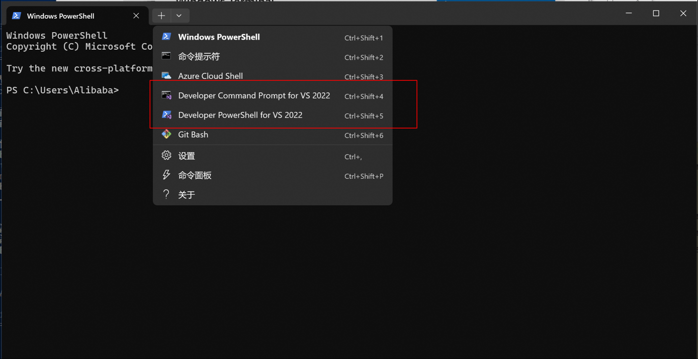

# Demo App

This chapter will introduce the methods for compiling and running demos on various system platforms. The demo code is located in the `demo` directory, structured as follows:

```bash
demo
├── CMakeLists.txt
├── android     # Android demo
├── app.cmake   #
├── desktop     # Desktop demo, including Windows and Linux
├── ios         # iOS demo
└── mac         # MacOS demo
```

::: tip
The source code is compiled using CMake. The latest pre-compiled libraries for each platform can be found [here](https://github.com/pixpark/gpupixel/releases/latest).
:::

## iOS
Ensure that the iOS library has been compiled (see [instructions](build#ios)). Open `gpupixel/demo/ios/GPUPixelApp.xcodeproj` with Xcode.

**Project Structure**

```bash
├── ImageFilterController.h         
├── ImageFilterController.mm        # Image filter controller
├── VideoCapturer.h
├── VideoCapturer.m                 # Camera capture wrapper
├── VideoFilterController.h
├── VideoFilterController.mm        # Camera filter controller
├── ViewController.h
├── ViewController.mm               # Demo entry controller
└── sample_face.png                 # Demonstration image
```

To run, simply connect an iPhone or use the simulator following the standard iOS App compilation and running procedure.
::: warning
For custom Xcode projects, disable `Build Settings -> Compress PNG Files` to prevent image color inversion.
:::
## MacOS
Ensure that the MacOS library has been compiled (see [instructions](build#mac)), then open `gpupixel/demo/mac/GPUPixelMacApp.xcodeproj` with Xcode.

**Project Structure**

```bash
├── VideoCameraManager.h
├── VideoCameraManager.mm   # Camera capture wrapper
├── ViewController.h
├── ViewController.mm       # Main logic for camera capture and GPUPixel filter invocation
```

Run the app following the standard Mac App compilation and running procedure.
::: warning
For custom Xcode projects, disable `Build Settings -> Compress PNG Files` to prevent image color inversion.
:::
## Android

Copy the generated `gpupixel-release.aar` to the `demo/android/app/libs` directory, then open the `demo/android` directory with Android Studio.

**Project Structure**

The invocation logic is in `MainActivity`. Select the app target and connect your phone to run it.
 
## Desktop

Desktop Demo compilation requires the following environment:

**Environment Requirements**
- Microsoft Visual Studio >= 2017 (Windows)
- cmake >= 3.10
- mesa-utils, libglu1-mesa-dev, freeglut3-dev, mesa-common-dev, libglfw3-dev (Linux)

**Windows Build Environment Setup**

It is recommended to use Windows Terminal and select the corresponding VS environment tab for compilation.

If not using Windows Terminal, you can configure as follows:

- **64-bit compilation**: Find and click `vcvars64.bat` (x64 Native Tools Command Prompt for VS 2017) in settings to open the VS virtual environment for compiling x64 architecture programs

::: warning
Windows only supports generating x86_64 Release version, x86_32 is not supported currently
:::

**Generating the Project**
::: code-group
```bash [Windows]
# Generate project
cmake -G "NMake Makefiles" -B build -S . -DCMAKE_BUILD_TYPE=Release
```
```bash [Linux]
# Generate project
cmake -G "Unix Makefiles" -B build -S . -DCMAKE_BUILD_TYPE=Release
```
:::

**Compiling**
```bash
# Build
cmake --build build --config Release
```

**Keyboard Shortcuts**

After running the demo, use the keyboard to adjust beauty effects, specifically:

`A` `S` `D` `F` `G` `H` - Increase the level of `smoothing`, `whitening`, `slimming`, `enlarging eyes`, `lipstick`, `blush`

`Z` `X` `C` `V` `B` `N` - Decrease the level of `smoothing`, `whitening`, `slimming`, `enlarging eyes`, `lipstick`, `blush`