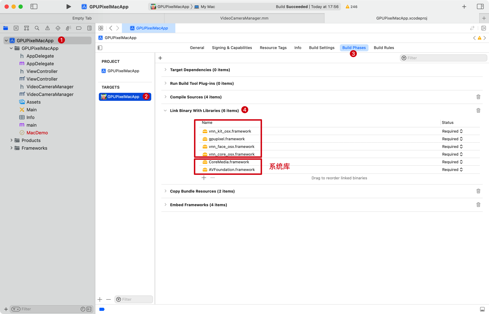

# Integration

This chapter will introduce the integration methods for GPUPixel across different systems. The latest pre-compiled libraries for each platform can be downloaded [here](https://github.com/pixpark/gpupixel/releases/latest).

## iOS & MacOS

The linking method for both iOS and MacOS libraries is the same, so they will be covered together.

### Adding Dependencies

Copy the gpupixel and vnn libraries to your project directory.
::: code-group
```bash [iOS]
├── gpupixel.framework
├── vnn_core_ios.framework
├── vnn_face_ios.framework
└── vnn_kit_ios.framework
```
```bash [MacOS]
├── gpupixel.framework
├── vnn_core_osx.framework
├── vnn_face_osx.framework
└── vnn_kit_osx.framework
```
:::

Select `Project -> Targets -> Build Phases -> Link Binary With Libraries`.

Click the `+` button in the lower left corner to add the dependencies mentioned above. The `CoreMedia.framework` and `AVFoundation.framework` are system libraries that provide capabilities such as camera capture. After adding them, the situation should resemble the following image.



**Framework Search Paths**

Click `Targets -> Build Settings -> Search Paths -> Framework Search Paths`, input `gpupixel`和`vnn` framework paths.


**Embedding Frameworks**

Select `Project -> Targets -> General -> Frameworks, Libraries, and Embedded Content`.

Set gpupixel and vnn libraries to `Embed & Sign`, choose `Do Not Embed` for system libraries, as shown below.


### Objective-C Invocation

Since GPUPixel is written in C++, to call C++ from Objective-C (OC), the file extension for OC source files must be changed from `.m` to `.mm`. This allows for mixed compilation between OC and C++.

All public headers for GPUPixel are included in `gpupixel.h`. By importing 

```objective-c
#import <gpupixel/gpupixel.h>
```

you can access all the functions. For detailed library function calls, refer [here](#).


### Swift Invocation
Starting from Swift 5.9, direct interaction with C++ is possible, also through bridging header files, eliminating the need for an intermediate step with Objective-C. You can refer to [this article](https://cloud.tencent.com/developer/article/2312347) or the official Swift documentation on [Mixing Swift and C++](https://www.swift.org/documentation/cxx-interop/#calling-c-functions).

## Android

Download the latest `gpupixel-release.aar` and place it under your Android project, such as in the `libs` directory.

Add the dependency in the gradle file:

```gradle
dependencies {
    implementation files('libs/gpupixel-release.aar')
}
```
Then sync the project. Refer to the Android Demo for more details.

Reference article: 
[Importing AAR Package in Android](https://juejin.cn/post/7226600031569510459)

## Windows
  
## Linux
