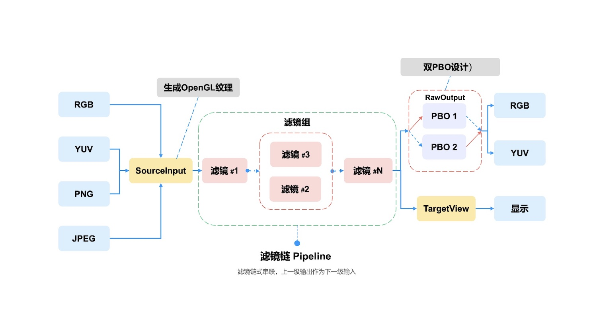

# 简介

## 开发背景
做音视频开发绕不开的一个问题就是视频图像的处理，视频图像处理的诉求有很多，比如短视频直播时代的刚需：美颜，也有一些图像画质增强方面的需求。

图像处理框架有很多，传统的比如 OpenCV，一个非常经典伟大的图像处理库，另外针对各个平台也有一些特定平台的图像处理库，如iOS端大名鼎鼎的 GPUImage，Android端的 GPUImage-Android等等，他们都是非常优秀的开源库。

但是他们也有各种的缺点，比如 OpenCV 处理的速度可能较慢，不能满足实时视频或者移动端视频处理的需求，GPUImage 和 GPUImage-Android的使用又局限于一个平台，同时他们只提供基础的图像处理能力，像美颜等高级功能需要在框架的基础上进行二次开发。

做音视频开发也很多年了，渴望有个多端统一的图像处理方案，又能提供基础的图像处理能力，所以写了 GPUPixel，支持的平台包括iOS、Mac、Android、Windows和Linux。

## 项目简介
GPUPixel 使用C++11编写，摒弃了裸指针，有效的防止内存泄露等问题的产生。框架架构类似 GPUImage，基于OpenGL拥有极高的性能，完全满足移动端和实时图像处理场景的使用，单帧处理基本小于10ms。

而且容易编译和集成，多端接口统一，库文件也非常小。功能方面，内置的多种滤镜，如美颜，可以实现商业级别的效果。

支持图片和视频输入，输出格式支持RGBA, YUV420P等格式，非常方便为直播，音视频会议等提供美颜滤镜能力支持！

## 效果预览
👉 **视频: <a href="https://youtu.be/9BY1Qx1NEPs" target="_blank">YouTube</a> | <a href="https://www.bilibili.com/video/BV1xQ4y1L7Fh/?share_source=copy_web&vd_source=46adcb1014fa989cfcbb4cc1e866831e" target="_blank">BiliBili</a>**

|              **原图**              |                **磨皮**                |               **美白**               |              **ThinFace**              |
| :--------------------------------: | :------------------------------------: | :----------------------------------: | :------------------------------------: |
|  |      |      |  |
|              **大眼**              |                **口红**                |               **腮红**               |                  **开                  | 关** |
|  |  |  |      |
 
## 架构流程

 
## 特性对比

✅: 支持 | ❌: 不支持 | ✏️: 计划中

|                   | [GPUPixel](https://github.com/pixpark/gpupixel) | [GPUImage](https://github.com/BradLarson/GPUImage) |
| :---------------- | :---------------------------------------------: | :------------------------------------------------: |
| 🍎**滤镜:**        |                        ✅                        |                         ❌                          |
| 磨皮              |                        ✅                        |                         ❌                          |
| 美白              |                        ✅                        |                         ❌                          |
| 瘦脸              |                        ✅                        |                         ❌                          |
| 大眼              |                        ✅                        |                         ❌                          |
| 口红              |                        ✅                        |                         ❌                          |
| 腮红              |                        ✅                        |                         ❌                          |
| 内建滤镜          |                        ✅                        |                         ✅                          |
| 🍓**输入格式：**   |                                                 |                                                    |
| YUV420P(I420)     |                        ✅                        |                         ❌                          |
| RGBA              |                        ✅                        |                         ✅                          |
| JPEG              |                        ✅                        |                         ✅                          |
| PNG               |                        ✅                        |                         ✅                          |
| NV21(for Android) |                        ✏️                        |                         ❌                          |
| 🍉**输出格式 :**   |                                                 |                                                    |
| RGBA              |                        ✅                        |                         ✅                          |
| YUV420P(I420)     |                        ✅                        |                         ❌                          |
| 🥑**平台系统:**    |                                                 |                                                    |
| iOS               |                        ✅                        |                         ✅                          |
| Mac               |                        ✅                        |                         ✅                          |
| Android           |                        ✅                        |                         ❌                          |
| Win               |                        ✅                        |                         ❌                          |
| Linux             |                        ✅                        |                         ❌                          |

## 系统支持
|           OS           |  iOS  |  OSX  |   Android    | Windows | Linux |
| :--------------------: | :---: | :---: | :----------: | :-----: | :---: |
| Min Support OS Version | 10.0  | 10.13 | 5.0 (API 21) |    -    |   -   |

##  性能和体积
### iPhone
|       -        | iPhone 6P | iPhone 8 | iPhone X | iPhone 11 | iPhone 14 pro |
| :------------: | :-------: | :------: | :------: | :-------: | :-----------: |
|    **CPU**     |    5%     |    5%    |    3%    |    3%     |      3%       |
| **Time Taken** |   10ms    |   4ms    |   3ms    |    3ms    |      3ms      |
### Android
|     -      | Xiaomi 10 | Huawei Mate30 | Vivo  | SAMSUNG | Google Pixel |
| :--------: | :-------: | :-----------: | :---: | :-----: | :----------: |
|    CPU     |    3%     |      5%       |   -   |    -    |      -       |
| Time Taken |    6ms    |      5ms      |   -   |    -    |      -       |
 
### 库体积

|       | iOS(.framework) | MacOS(.framework) | Android(.aar) |
| :---: | :-------------: | :---------------: | :-----------: |
| Size  |     2.4 MB      |      2.6 MB       |    2.1 MB     |

## 参与贡献
欢迎参与此项目，贡献代码，同时希望通过在社交媒体分享 GPUPixel 项目来支持本项目  👏🏻.

## 项目未来

项目目前也获得了一定的关注，但是和 GPUImage 等库相比使用量还比较少，另外 GPUPixel 还有不少功能和需要优化的点，比如增加背景替换，提供 Python 和 WebAssembly 封装支持等。

项目的 issue 也会积极处理，这个库会一直做下去，也希望有更多朋友参与进来。毕竟个人的力量有限，另外对于 GPU 处理图像还有很多问题也没有搞太懂，希望大家一块交流互相启发~

如果这个库对你有帮助，也希望多多支持，点赞转发这个项目，让更多人了解~🙏

## 参考项目
1. [GPUImage](https://github.com/BradLarson/GPUImage) 
2. [CainCamera](https://github.com/CainKernel/CainCamera)
3. [AwemeLike](https://github.com/ZZZZou/AwemeLike)
4. [VNN](https://github.com/joyycom/VNN)

## License
This repository is available under the [MIT License](https://github.com/pixpark/gpupixel?tab=MIT-1-ov-file#readme).

