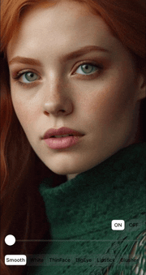
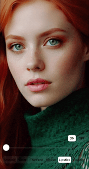

# Introduction

## Development Background
An unavoidable issue in audio and video development is the processing of video images. There are many demands for video image processing, such as the essential feature of beautification in the era of short videos and live streaming, as well as the need for image quality enhancement.

There are numerous frameworks for image processing. Traditional ones like OpenCV, a classic and remarkable image processing library, stand out. Additionally, there are platform-specific image processing libraries for different platforms, such as the renowned GPUImage for iOS and GPUImage-Android for Android; these are all excellent open-source libraries.

However, they each have their drawbacks. For example, the processing speed of OpenCV may be slower, unable to meet the needs of real-time video or mobile video processing. The use of GPUImage and GPUImage-Android is limited to a single platform, and while they provide basic image processing capabilities, advanced features like beautification require secondary development on top of the framework.

Having been involved in audio and video development for many years, I yearned for a unified multi-platform image processing solution that could provide not only basic image processing capabilities but also support for advanced features. Thus, GPUPixel was born, supporting platforms including iOS, Mac, Android, Windows, and Linux.

## Project Overview
GPUPixel is written in C++11, eschewing raw pointers to effectively prevent issues like memory leaks. Its architecture is similar to that of GPUImage, leveraging OpenGL for exceptional performance, fully capable of meeting the requirements of mobile devices and real-time image processing scenarios, with per-frame processing times consistently under 10ms.

Moreover, it is easy to compile and integrate, with a unified interface across multiple platforms, and the library files are very small. In terms of functionality, it includes various built-in filters, such as beautification, achieving commercial-grade results.

It supports both image and video input, with output formats including RGBA, YUV420P, and others, making it extremely convenient for providing beautification filter capabilities for live streaming, audio-video conferencing, and more!
## Effects Preview

👉 **Video: <a href="https://youtu.be/9BY1Qx1NEPs" target="_blank">YouTube</a> | <a href="https://www.bilibili.com/video/BV1xQ4y1L7Fh/?share_source=copy_web&vd_source=46adcb1014fa989cfcbb4cc1e866831e" target="_blank">BiliBili</a>**

|                   **Origin**                    |                    **Smooth**                     |                    **White**                     |                   **ThinFace**                    |
| :---------------------------------------------: | :-----------------------------------------------: | :----------------------------------------------: | :-----------------------------------------------: |
|  |    |    |  |
|                   **BigEye**                    |                   **Lipstick**                    |                   **Blusher**                    |                    **ON-OFF**                     |
|  |  |  |    |

## Architecture

## Features

This table compares the features supported by **GPUPixel** and **GPUImage** and **Android-GPUImage**:

✅: Supported | ❌: Not supported | ✏️: Planning

|                       | [GPUPixel](https://github.com/pixpark/gpupixel) | [GPUImage](https://github.com/BradLarson/GPUImage) | [Android-GPUImage](https://github.com/cats-oss/android-gpuimage) |
| :-------------------- | :---------------------------------------------: | :------------------------------------------------: | :----------------------------------------------------------: |
| 📷 **Filters:**        |                        ✅                        |                         ❌                          |                              ❌                               |
| Skin Smoothing Filter |                        ✅                        |                         ❌                          |                              ❌                               |
| Skin Whitening Filter |                        ✅                        |                         ❌                          |                              ❌                               |
| Face Slimming Filter  |                        ✅                        |                         ❌                          |                              ❌                               |
| Big Eyes Filter       |                        ✅                        |                         ❌                          |                              ❌                               |
| Lipstick Filter       |                        ✅                        |                         ❌                          |                              ❌                               |
| Blush Filter          |                        ✅                        |                         ❌                          |                              ❌                               |
| More Build in Filter  |                        ✅                        |                         ✅                          |                              ✅                               |
| 🎬 **Input Formats:**  |                                                 |                                                    |                                                              |
| YUV420P(I420)         |                        ✅                        |                         ❌                          |                              ❌                               |
| RGBA                  |                        ✅                        |                         ✅                          |                              ✅                               |
| JPEG                  |                        ✅                        |                         ✅                          |                              ✅                               |
| PNG                   |                        ✅                        |                         ✅                          |                              ✅                               |
| NV21(for Android)     |                        ✏️                        |                         ❌                          |                              ❌                               |
| 🎥 **Output Formats:** |                                                 |                                                    |                                                              |
| RGBA                  |                        ✅                        |                         ✅                          |                              ✅                               |
| YUV420P(I420)         |                        ✏️                        |                         ❌                          |                              ❌                               |
| 💻 **Platform:**       |                                                 |                                                    |                                                              |
| iOS                   |                        ✅                        |                         ✅                          |                              ❌                               |
| Mac                   |                        ✅                        |                         ✅                          |                              ❌                               |
| Android               |                        ✅                        |                         ❌                          |                              ✅                               |
| Win                   |                        ✅                        |                         ❌                          |                              ❌                               |
| Linux                 |                        ✅                        |                         ❌                          |                              ❌                               |

##  Performance
### iPhone
|       -        | iPhone 6P | iPhone 8 | iPhone X | iPhone 11 | iPhone 14 pro |
| :------------: | :-------: | :------: | :------: | :-------: | :-----------: |
|    **CPU**     |    5%     |    5%    |    3%    |    3%     |      3%       |
| **Time Taken** |   10ms    |   4ms    |   3ms    |    3ms    |      3ms      |
### Android
|     -      | Xiaomi 10 | Huawei Mate30 | Vivo  | SAMSUNG | Google Pixel |
| :--------: | :-------: | :-----------: | :---: | :-----: | :----------: |
|    CPU     |    3%     |      5%       |   -   |    -    |      -       |
| Time Taken |    6ms    |      5ms      |   -   |    -    |      -       |

## Lib Size

|       | iOS(.framework) | MacOS(.framework) | Android(.aar) |
| :---: | :-------------: | :---------------: | :-----------: |
| Size  |     2.4 MB      |      2.6 MB       |    2.1 MB     |

## Contributing
We welcome contributions to this project, whether through code contributions or by supporting the project by sharing the GPUPixel project on social media. 👏🏻

## Future of the Project
The project has gained some attention, but compared to libraries like GPUImage, its usage is still relatively low. GPUPixel has several features and optimizations planned, such as adding background replacement and providing Python and WebAssembly encapsulation support.

Issues related to the project will be actively addressed, and this library will continue to evolve. We hope for more participation, as individual efforts are limited, and there are still many aspects of GPU image processing that are not fully understood. We look forward to collective learning and inspiration.

If this library is helpful to you, we also hope for your support, liking and sharing this project to make it known to more people. 🙏

## Reference Projects

Please note that the reference projects section was not translated as no specific projects were listed in the original text. If you have specific projects in mind, you should list them here in the same manner as in the original text.

1. [GPUImage](https://github.com/BradLarson/GPUImage) 
2. [CainCamera](https://github.com/CainKernel/CainCamera)
3. [AwemeLike](https://github.com/ZZZZou/AwemeLike)
4. [VNN](https://github.com/joyycom/VNN)

## License
This repository is available under the [MIT License](https://github.com/pixpark/gpupixel?tab=MIT-1-ov-file#readme).

