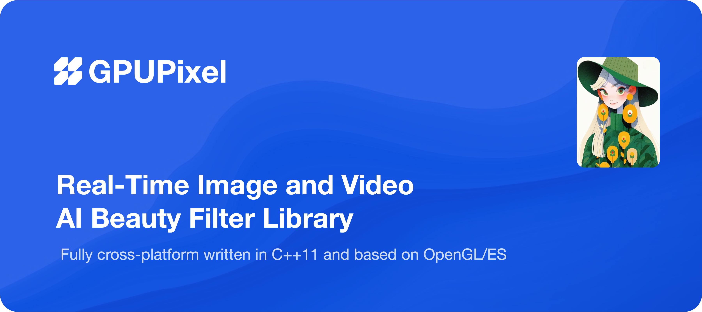
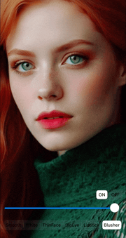

# 简介
⛰️ GPUPixel是一个使用C++11编写的高性能图像和视频AI美颜效果库，非常容易编译和集成，并且库文件非常小。

🔑 它是基于GPU的，并且带有内置的美颜效果滤镜，可以实现商业级别的效果。

🔌 它支持的平台包括iOS、Mac和Android，理论上可以移植到任何支持OpenGL/ES的平台。

## 效果预览
👉 **视频: <a href="https://youtu.be/9BY1Qx1NEPs" target="_blank">YouTube</a> | <a href="https://www.bilibili.com/video/BV1xQ4y1L7Fh/?share_source=copy_web&vd_source=46adcb1014fa989cfcbb4cc1e866831e" target="_blank">BiliBili</a>**

|              **原图**              |                **磨皮**                |               **美白**               |              **瘦脸**              |
| :--------------------------------: | :------------------------------------: | :----------------------------------: | :------------------------------------: |
|  |      |      |  |
|              **大眼**              |                **口红**                |               **腮红**               |                  **开关** |
|  |  |  |      |

## 功能对比

✅: 支持 | ❌: 不支持 | ✏️: 计划中

|                   | [GPUPixel](https://github.com/pixpark/gpupixel) | [GPUImage](https://github.com/BradLarson/GPUImage) |
| :---------------- | :---------------------------------------------: | :------------------------------------------------: |
| 🍎**滤镜:**        |                        ✅                        |                         ❌                          |
| 磨皮              |                        ✅                        |                         ❌                          |
| 美白              |                        ✅                        |                         ❌                          |
| 瘦脸              |                        ✅                        |                         ❌                          |
| 大眼              |                        ✅                        |                         ❌                          |
| 口红              |                        ✅                        |                         ❌                          |
| 腮红              |                        ✅                        |                         ❌                          |
| 内建滤镜          |                        ✅                        |                         ✅                          |
| 🍓**输入格式：**   |                                                 |                                                    |
| YUV420P(I420)     |                        ✅                        |                         ❌                          |
| RGBA              |                        ✅                        |                         ✅                          |
| JPEG              |                        ✅                        |                         ✅                          |
| PNG               |                        ✅                        |                         ✅                          |
| NV21(for Android) |                        ✏️                        |                         ❌                          |
| 🍉**输出格式 :**   |                                                 |                                                    |
| RGBA              |                        ✅                        |                         ✅                          |
| YUV420P(I420)     |                        ✅                        |                         ❌                          |
| 🥑**平台系统:**    |                                                 |                                                    |
| iOS               |                        ✅                        |                         ✅                          |
| Mac               |                        ✅                        |                         ✅                          |
| Android           |                        ✅                        |                         ❌                          |
| Win               |                        ✅                       |                         ❌                          |
| Linux             |                        ✅                        |                         ❌                          |