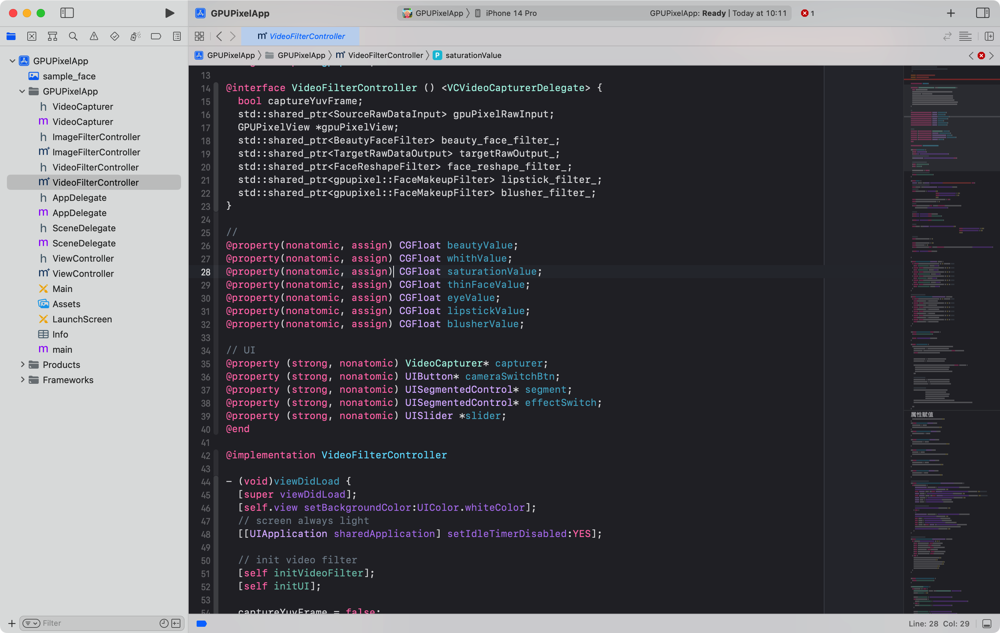
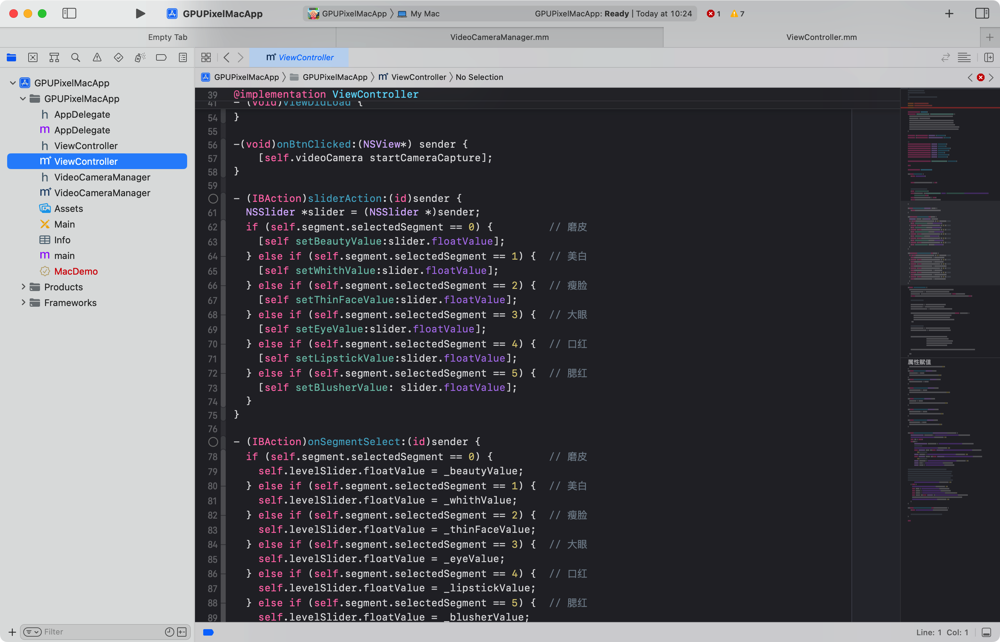
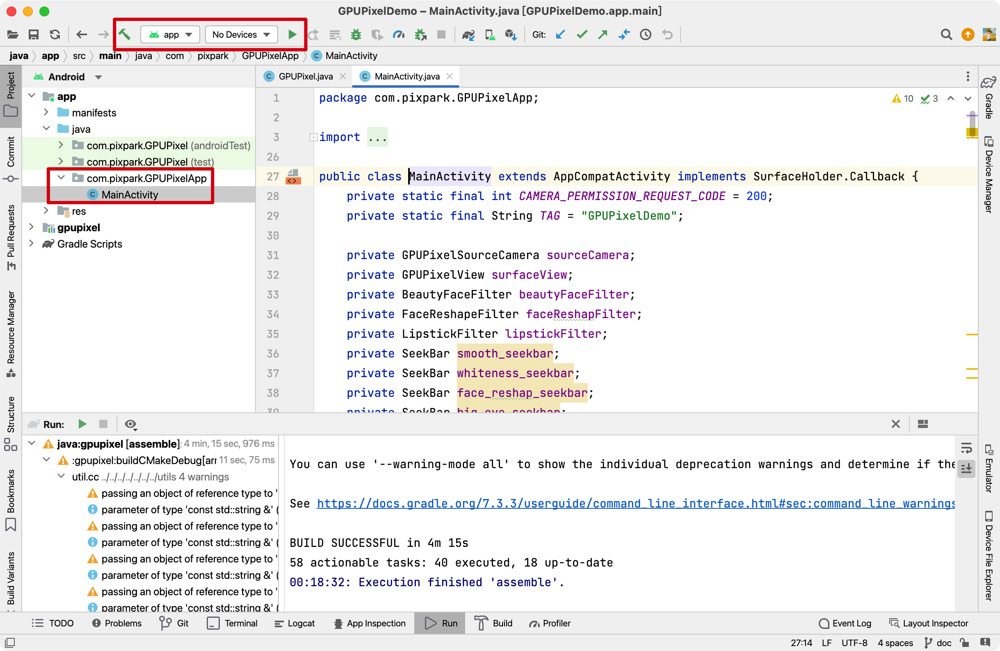

# 示例程序

本章将介绍各个系统平台Demo编译和运行方法, Demo代码位于 `examples`目录，结构如下：
```bash
examples
├── CMakeLists.txt
├── android     # 安卓 demo
├── app.cmake   
├── desktop     # 桌面 demo, 包括 Windows 和 Linux
├── ios         # iOS demo
└── mac         # MacOS demo
```

::: tip
源码使用CMake编译。最新编译好的各个平台库可以从[这里](https://github.com/pixpark/gpupixel/releases/latest)找到
:::

## iOS
确保iOS库已编译好（[参考](build#ios)），xcode 打开 `gpupixel/examples/ios/GPUPixelApp.xcodeproj`

**工程结构**

```bash
├── ImageFilterController.h         
├── ImageFilterController.mm        # 图片滤镜控制器
├── VideoCapturer.h
├── VideoCapturer.m                 # 相机采集封装
├── VideoFilterController.h
├── VideoFilterController.mm        # 相机滤镜控制器
├── ViewController.h
├── ViewController.mm               # demo 入口控制器
└── sample_face.png                 # 演示图片
```

按正常 iOS App编译运行方法连接iPhone或模拟器运行即可



**报错**

若编译报错，检查工程库链接是否设置正确，gpupixel以及 vnn等framework 是否存在


## Mac
确保MacOS库已编译好([参考](build#mac)), xcode打开 `gpupixel/examples/mac/GPUPixelMacApp.xcodeproj`

**工程结构**

```bash
├── VideoCameraManager.h
├── VideoCameraManager.mm   # 相机采集封装
├── ViewController.h
├── ViewController.mm       # 相机采集和 GPUPixel 滤镜调用主逻辑
```

按正常 Mac App编译运行方法运行即可



**报错**

若编译报错，检查工程库链接是否设置正确，gpupixel以及 vnn等framework 是否存在


## Android

使用Android Studio打开目录 `src/android/java`, 开始自动下载 gradle 等依赖

**工程结构**

包含demo和 gpupixel module, 调用逻辑在 `MainActivity` 中选择 app target 连上手机运行即可



## Desktop


**生成工程**
::: code-group
```bash [Windows]
# Generate project
cmake -G "MinGW Makefiles" -B examples/build -S examples
```
```bash [Linux]
# Generate project
cmake -B examples/build -S examples
```
:::

**编译**
::: code-group

```bash [Release]
# Build
cmake --build build -DCMAKE_BUILD_TYPE=Release
```

```bash [Debug]
# Build
cmake --build build -DCMAKE_BUILD_TYPE=Debug 
```
:::
 
**按键**

Demo运行起来后，按键盘调节美颜程度，具体如下：

`A` `S` `D` `F` `G` `H` - 增加`磨皮`, `美白`, `瘦脸`, `大眼`, `口红`, `腮红`等级

`Z` `X` `C` `V` `B` `N` - 减少`磨皮`, `美白`, `瘦脸`, `大眼`, `口红`, `腮红`等级 


## Web


## Python
