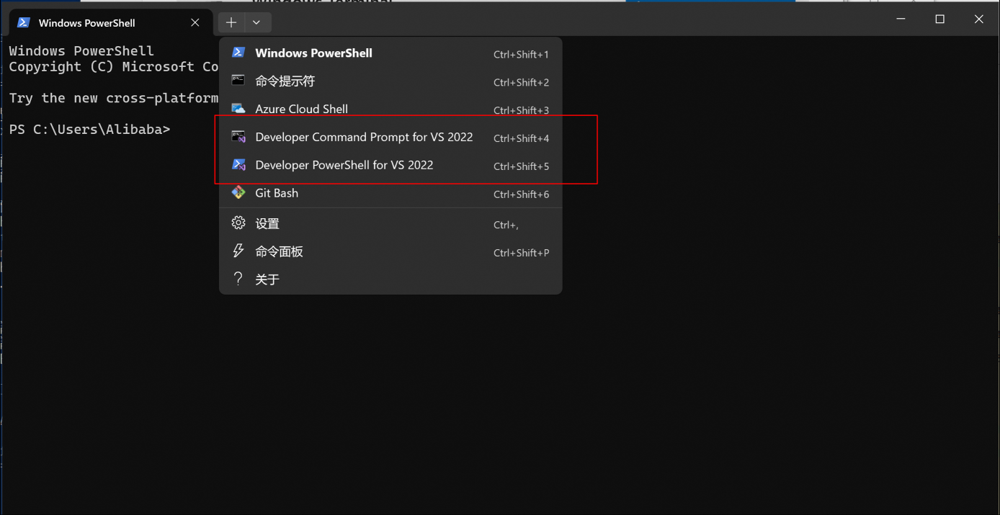

# 示例程序

本章将介绍各个系统平台Demo编译和运行方法, Demo代码位于 `examples`目录，结构如下：
```bash
examples
├── CMakeLists.txt
├── app.cmake   
├── desktop     # 桌面 demo, 包括 Windows 和 Linux
├── ios         # iOS demo
└── mac         # MacOS demo
```

::: tip
源码使用CMake编译。最新编译好的各个平台库可以从[这里](https://github.com/pixpark/gpupixel/releases/latest)找到
:::

## iOS
确保iOS库已编译好（[参考](build#ios)），xcode 打开 `gpupixel/examples/ios/GPUPixelApp.xcodeproj`

**工程结构**

```bash
├── ImageFilterController.h         
├── ImageFilterController.mm        # 图片滤镜控制器
├── VideoCapturer.h
├── VideoCapturer.m                 # 相机采集封装
├── VideoFilterController.h
├── VideoFilterController.mm        # 相机滤镜控制器
├── ViewController.h
├── ViewController.mm               # demo 入口控制器
└── sample_face.png                 # 演示图片
```
::: warning
如果是自己创建的 Xcode工程，记得把工程 `Build Settings -> Compress PNG Files  -> NO` 选项关掉，否则会照成图片反色
:::

## Mac
确保MacOS库已编译好([参考](build#mac)), xcode打开 `gpupixel/examples/mac/GPUPixelMacApp.xcodeproj`

**工程结构**

```bash
├── VideoCameraManager.h
├── VideoCameraManager.mm   # 相机采集封装
├── ViewController.h
├── ViewController.mm       # 相机采集和 GPUPixel 滤镜调用主逻辑
```
::: warning
如果是自己创建的 Xcode工程，记得把工程 `Build Settings -> Compress PNG Files  -> NO` 选项关掉，否则会照成图片反色
:::
## Android

使用Android Studio打开目录 `src/android/java`, 开始自动下载 gradle 等依赖

**工程结构**

包含demo和 gpupixel module, 调用逻辑在 `MainActivity` 中选择 app target 连上手机运行即可

## Desktop

Desktop Demo 编译需要安装以下环境：

**环境要求**
- Microsoft Visual Studio >= 2017 (Windows)
- cmake >= 3.10
- mesa-utils, libglu1-mesa-dev, freeglut3-dev, mesa-common-dev, libglfw3-dev (Linux)

**Windows编译环境配置**

推荐使用 Windows Terminal，在Terminal中选择对应的VS环境Tab后进行编译。

如不使用Windows Terminal，可按如下方式配置：

- **64位编译**：在设置中找到`vcvars64.bat`（适用于 VS 2017 的 x64 本机工具命令提示）并单击，打开VS编译x64架构程序的虚拟环境

::: warning
Windows仅支持生成 x86_64 Release 版本，暂不支持 x86_32
:::

**生成工程**
::: code-group
```bash [Windows]
# Generate project
cmake -G "NMake Makefiles" -B build -S . -DCMAKE_BUILD_TYPE=Release
```
```bash [Linux]
# Generate project
cmake -B build -S . -DCMAKE_BUILD_TYPE=Release
```
:::

**编译**

```bash
# Build
cmake --build build --config Release
```
 
**按键**

Demo运行起来后，按键盘调节美颜程度，具体如下：

`A` `S` `D` `F` `G` `H` - 增加`磨皮`, `美白`, `瘦脸`, `大眼`, `口红`, `腮红`等级

`Z` `X` `C` `V` `B` `N` - 减少`磨皮`, `美白`, `瘦脸`, `大眼`, `口红`, `腮红`等级
